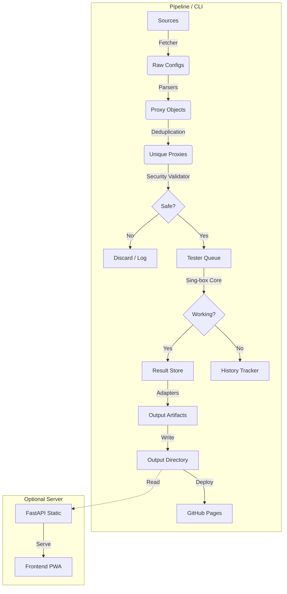

# Architecture Overview 🏗️

ConfigStream is designed as a modern, asynchronous data pipeline. It prioritizes speed, modularity, and resilience, utilizing a CLI-driven architecture that automates the entire lifecycle of proxy aggregation via GitHub Actions.

## High-Level Diagram

## Core Components

### 1. Pipeline-First Design
The core of ConfigStream is the `configstream merge` CLI command.
-   **Stateless Execution**: Designed to run in ephemeral environments (GitHub Actions).
-   **State Persistence**: Uses SQLite and JSON artifacts to persist intelligence (reliability scores, caches) between runs via `actions/cache`.

### 2. Ingestion Layer (`fetcher.py` & `parsers.py`)
-   **Concurrency**: Uses `asyncio` and `aiohttp` to fetch from hundreds of sources simultaneously.
-   **Protocol Support**:
    -   **Standard**: VMess, VLESS, Trojan, Shadowsocks.
    -   **Advanced**: Hysteria 2, Tuic, SSH.
    -   **Obfuscation**: Handles various transport layers (ws, grpc, httpupgrade).
-   **Fuzzing**: Parsers are hardened using `hypothesis` to prevent crashes on malformed input.

### 3. Intelligence Layer (`source_quality.py` & `adaptive_timeout.py`)
-   **SourceQualityTracker**: Monitors source reliability over time.
    -   **Smart Scoring**: Ranks sources by yield and quality.
    -   **Adaptive Scheduling**: Adjusts testing frequency based on source health.
-   **Adaptive Timeouts**: Learns optimal timeout values per source to minimize latency penalties.

### 4. Validation Layer (`testers.py` & `security/`)
-   **Engine**: Uses `sing-box` (via `singbox2proxy`) as the testing core for accurate results.
-   **Security Checks**:
    -   **Blocklist**: Filters IPs against FireHol Level 1.
    -   **Honey Pot**: Detects proxies that redirect traffic to phishing sites.
    -   **MITM**: Verifies SSL certificate fingerprints.
    -   **Content Injection**: Detects modification of page content.
-   **GeoIP**: Offline resolution of IP to Country/ASN using local MMDB (MaxMind).

### 5. Output & Adapters (`output.py` & `adapters.py`)
-   **Universal Conversion**: Handles serialization to various client formats.
    -   **Open**: Clash, Sing-box, Base64.
-   **Ranked Outputs**: Generates "Chosen Top 1000" subsets based on latency and reliability.
-   **Artifacts**: All outputs are saved to `output/` for static hosting.

## Frontend (PWA)

The frontend is a static Progressive Web App (PWA) built with vanilla JavaScript.
-   **Static Hosting**: Designed to be served from GitHub Pages (via `output/` artifacts).
-   **Visualization**:
    -   **Charts**: Historical availability trends.
    -   **Map**: Interactive world map of proxy locations.
-   **Data Source**: Consumes `proxies.json` and `metadata.json` directly from the static host.

## Data Persistence

-   **SQLite**: Used for intelligence stats (`data/source_quality.json`, `data/test_cache.json`).
-   **File System**: Used for transient state and final artifacts.

## Security Model

1.  **Input Sanitization**: All external data is treated as untrusted.
2.  **Secret Scanning**: Pre-commit hooks (`gitleaks`) prevent leaking keys.
3.  **Dependency Hardening**: Dependencies are pinned in `pyproject.toml` and `requirements.txt`.
4.  **Least Privilege**: GitHub Actions tokens have restricted scopes.

## Future Roadmap

-   [ ] Reinforcement Learning for scheduler tuning.
-   [ ] Rust rewrites for hot-path parsers.
-   [ ] Distributed workers for massive scale.
