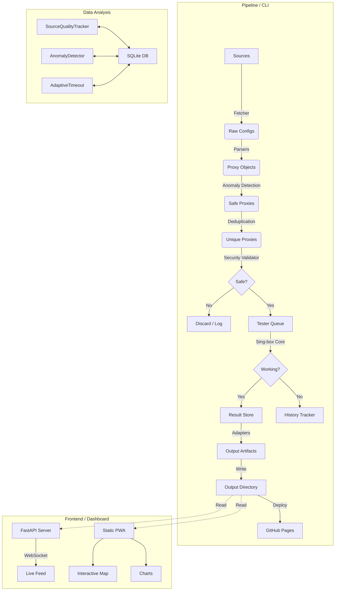

# Architecture Overview 🏗️

ConfigStream is designed as a modern, asynchronous data pipeline. It prioritizes speed, modularity, and resilience, utilizing a CLI-driven architecture that automates the entire lifecycle of proxy aggregation via GitHub Actions.

## High-Level Diagram

## Core Components

### 1. Pipeline-First Design
The core of ConfigStream is the `configstream merge` CLI command.
-   **Stateless Execution**: Designed to run in ephemeral environments (GitHub Actions).
-   **State Persistence**: Uses SQLite and JSON artifacts to persist intelligence (reliability scores, caches, anomaly history) between runs.

### 2. Ingestion Layer (`fetcher.py`, `parsers.py`)
-   **Concurrency**: Uses `asyncio` and `aiohttp` to fetch from hundreds of sources simultaneously.
-   **Protocol Support**:
    -   **Standard**: VMess, VLESS, Trojan, Shadowsocks (SIP002).
    -   **Advanced**: Hysteria 2, Tuic v5, Juicity, SSH Tunnels, WireGuard.
    -   **Obfuscation**: Handles various transport layers (ws, grpc, httpupgrade).
-   **Anomaly Detection**: `AnomalyDetector` uses Isolation Forests (ML) to identify and reject traffic spikes or poisoning attempts.

### 3. Intelligence Layer
-   **SourceQualityTracker**: Monitors source reliability over time.
    -   **Smart Scoring**: Ranks sources by yield and "geo-diversity" (Gini Index).
    -   **Adaptive Scheduling**: Adjusts testing frequency based on source health.
-   **Adaptive Timeouts**: Learns optimal timeout values per source to minimize latency penalties.

### 4. Validation Layer (`testers.py`, `security/`)
-   **Engine**: Uses `sing-box` (via `singbox2proxy`) as the testing core for accurate results.
-   **Security Checks**:
    -   **Active MITM**: Verifies SSL certificate issuers against known interception tools.
    -   **Honey Pot**: Detects proxies that redirect traffic to phishing sites or inject HTML.
    -   **Blocklist**: Filters IPs against FireHol Level 1.
-   **GeoIP**: Offline resolution of IP to Country/ASN using local MMDB.

### 5. Output & Adapters (`output.py`, `adapters.py`)
-   **Universal Conversion**: Handles serialization to various client formats.
    -   **Open**: Clash, Sing-box, Base64.
    -   **Proprietary**: Surge, Loon, Quantumult X.
    -   **Standard**: SIP008.
-   **Ranked Outputs**: Generates "Chosen Top 1000" subsets based on latency and reliability.

## Frontend (PWA)

The frontend is a Progressive Web App (PWA) built with vanilla JavaScript, Chart.js, and Leaflet.
-   **Live Feed**: Real-time WebSocket connection to the pipeline (when running server-side).
-   **Analytics**:
    -   **Charts**: 7-Day trend analysis and protocol distribution.
    -   **Map**: Interactive Leaflet map visualizing global proxy density.
-   **Offline Capable**: Uses Service Workers to cache assets and recent data.

## Data Persistence

-   **SQLite**: Used for intelligence stats (`data/*.db`).
-   **File System**: Used for transient state and final artifacts.
-   **Event Stream**: File-based IPC for communicating pipeline status to the WebSocket server.

## Security Model

1.  **Input Sanitization**: All external data is treated as untrusted.
2.  **Secret Scanning**: Pre-commit hooks (`gitleaks`) prevent leaking keys.
3.  **Dependency Hardening**: Dependencies are pinned in `pyproject.toml`.
4.  **Isolation**: Testing occurs in ephemeral subprocesses.

## Future Roadmap

-   [ ] Reinforcement Learning for scheduler tuning.
-   [ ] Rust rewrites for hot-path parsers.
-   [ ] Distributed workers (Celery/Redis) for massive scale.
