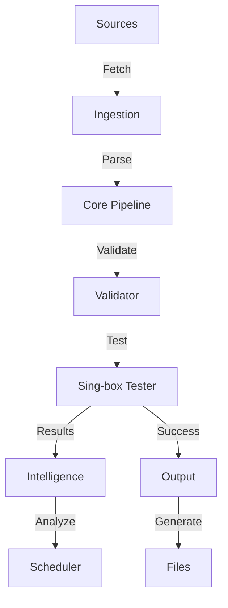

# Architecture Guide

ConfigStream is a high-performance, automated pipeline for aggregating, validating, and distributing proxy configurations.

## System Overview

The system follows a linear pipeline architecture with event-driven observability.

## Core Components

### 1. Ingestion Layer (`fetcher.py`)
- **Async Fetching**: Uses `httpx` for concurrent fetching with HTTP/2 support.
- **Smart Headers**: Rotates User-Agents and handles ETags.
- **Deduplication**: Fingerprints configs to avoid duplicate processing.

### 2. Processing Core (`pipeline.py`)
- **Streaming**: Uses `asyncio.Queue` for backpressure management.
- **Parsing**: `auto_detect.py` identifies protocols (VMess, VLESS, Trojan, etc.).
- **Normalization**: Standardizes config formats into a common `Proxy` model.

### 3. Validation & Testing (`testers.py`)
- **Sing-box Core**: Wraps the high-performance Sing-box binary for real connectivity tests.
- **Latency Measurement**: Calculates RTT with jitter penalties.
- **Security Checks**:
    - **MITM**: Checks SSL issuer against known interception tools.
    - **Injection**: Validates HTML content integrity (Honey Pot).
    - **Headers**: Ensures proxy doesn't strip security headers.

### 4. Intelligence Layer (`scheduler.py`, `source_quality.py`)
- **Smart Retest**: Skips recently tested "Good" proxies based on health score.
- **Source Scoring**: Tracks success rates of sources to prioritize fetch order.
- **Geo-Diversity**: Calculates Gini index to ensure global coverage.

### 5. Output Generation (`output.py`)
- **Categorization**: Splits proxies by protocol and country.
- **Formats**:
    - **Base64**: Universal subscription.
    - **Clash/Meta**: YAML configs.
    - **Sing-box**: JSON configs.
    - **Adapters**: Surge, Loon, etc.

## Data Flow

1. **Trigger**: GitHub Actions schedule (Cron) or manual dispatch.
2. **Fetch**: Sources are downloaded in parallel batches.
3. **Parse**: Content is parsed into `Proxy` objects.
4. **Filter**: Blocklist (IP) and Dedup checks.
5. **Test**:
    - Check Cache -> Return if fresh.
    - Else -> Run Sing-box test.
6. **Enrich**: Add GeoIP data (Country, ASN).
7. **Store**: Update History and Cache.
8. **Publish**: Generate artifacts in `output/`.

## Directory Structure

- `src/configstream/`: Application source code.
- `data/`: GeoIP databases and cache files.
- `output/`: Generated artifacts (publicly served).
- `frontend/`: Static web assets.
- `.github/workflows/`: CI/CD definitions.

## Deployment

- **Platform**: GitHub Actions (Runners).
- **Hosting**: GitHub Pages (Static).
- **Database**: SQLite (Ephemeral/Artifact-passed) + JSON Caches.
