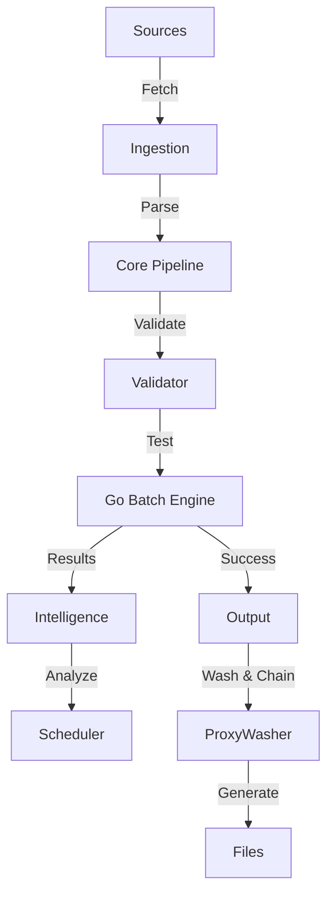

# Architecture Guide

ConfigStream is a high-performance, automated pipeline for aggregating, validating, and distributing proxy configurations.

## System Overview

The system follows a linear pipeline architecture with event-driven observability.

## Core Components

### 1. Ingestion Layer (`fetcher.py`)
- **Async Fetching**: Uses `httpx` for concurrent fetching with HTTP/2 support.
- **Resilience**: Implements Hedged Requests, Circuit Breakers, and Rate Limiting.
- **Memory Protection**: Enforces strict content length limits (50MB) to prevent OOM on CI runners.
- **Deduplication**: Fingerprints configs to avoid duplicate processing.

### 2. Processing Core (`pipeline.py`)
- **Streaming**: Uses `asyncio.Queue` for backpressure management.
- **Parallel Parsing**: Offloads CPU-intensive regex/decoding to a process executor to keep the event loop responsive.
- **Parsing**: `auto_detect.py` identifies protocols (VMess, VLESS, Trojan, Hysteria 2, etc.).
- **Normalization**: Standardizes config formats into a common `Proxy` model.

### 3. Validation & Testing (`testers.py` & `src/go/tester`)
- **High-Performance Go Engine**: Replaces Python subprocesses with a compiled Go binary for batch testing.
    - **Concurrency**: Uses worker pools and Goroutines to test thousands of proxies with minimal CPU overhead.
    - **Honeypot**: Verifies cryptographically signed tokens against a Cloudflare Worker to detect MITM attacks.
- **Sing-box Core**: Wraps Sing-box for legacy/fallback testing.
- **Latency Measurement**: Calculates RTT with jitter penalties.

### 4. Intelligence & Optimization (`output.py`)
The "Brain" of the system now includes active network engineering:

*   **Proxy Washing**:
    - **Recycling**: Instead of discarding "dirty" (Google-blocked) or "insecure" (No-TLS) proxies, the system wraps them in encrypted **WARP WireGuard** tunnels.
    - **Consistent Hashing**: Deterministically maps proxies to WARP keys, ensuring stable connections across updates.
*   **Intelligent Routing**:
    - **Intranet Bridge**: Chains domestic relays (e.g., IR) to foreign exits to bypass throttling.
    - **IPv6 Portal**: Uses IPv4 relays to access IPv6-only infrastructure.

### 5. Intelligence Layer
Located in `src/configstream/`, this layer optimizes resource usage and reliability.

*   **Anomaly Detection (`anomaly.py`)**:
    *   Uses statistical analysis (Isolation Forest conceptual model) to detect sources with unusual proxy counts.
    *   Prevents "poisoning" attacks where a source floods the system with thousands of bad proxies.
*   **Source Quality Tracking (`source_quality.py`)**:
    *   Maintains a long-term reputation score for every source URL.
    *   Tracks success rates, latency stability, and "geo-diversity".

### 6. Unified Frontend (`frontend/`)
The frontend is a single-page application (SPA) served statically via GitHub Pages.

*   **Analytics & Statistics**: Merged into `analytics.html`.
*   **Data Source**: Consumes `metadata.json` generated by the backend.
*   **Visualizations**: Uses Chart.js for protocol/latency distribution.
*   **PWA**: Fully offline-capable Progressive Web App.

### 7. Output Generation (`output.py`)
- **Formats**:
    - **singbox-vpn.json ("The Tank")**: Tun mode, auto-route, GVisor stack.
    - **singbox.json ("The Sniper")**: Smart Selector groups (Intranet Bridge, IPv6 Portal), Mixed Port.
    - **clash.yaml ("The Diplomat")**: Conservative, widely compatible.
    - **Base64**: Universal subscription.
    - **Adapters**: Surge, Loon, Quantumult X, SIP008, and Shadowrocket.

## Directory Structure

- `src/configstream/`: Application source code (Python).
- `src/go/tester/`: High-performance batch testing engine (Go).
- `data/`: GeoIP databases and cache files.
- `output/`: Generated artifacts (publicly served).
- `frontend/`: Static web assets (HTML, CSS, JS).
- `.github/workflows/`: CI/CD definitions.

## Deployment

- **Platform**: GitHub Actions (Runners).
- **Hosting**: GitHub Pages (Static).
- **Distribution**: Telegram, Hugging Face (Mirrors).
- **Database**: SQLite (Ephemeral/Artifact-passed) + JSON Caches.
