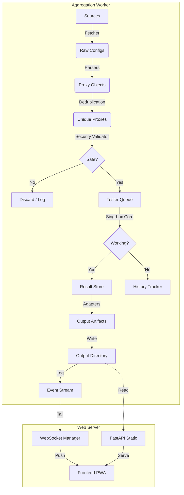

# Architecture Overview 🏗️

ConfigStream is designed as a modern, asynchronous data pipeline. It prioritizes speed, modularity, and resilience, adhering to a "Split Brain" architecture that separates data processing from data serving.

## High-Level Diagram

## Core Components

### 1. "Split Brain" Design
The system is divided into two independent runtimes:
-   **Worker**: A heavy-lifting process that runs the pipeline. It requires significant CPU/Network resources. It outputs static files (JSON/YAML) and logs events.
-   **Server**: A lightweight FastAPI process. It reads the static files to serve subscriptions and "tails" the worker's event stream to provide real-time updates via WebSockets. This allows the server to remain responsive even when the worker is under 100% load.

### 2. Ingestion Layer (`fetcher.py` & `parsers.py`)
-   **Concurrency**: Uses `asyncio` and `aiohttp` to fetch from hundreds of sources simultaneously.
-   **Protocol Support**:
    -   **Standard**: VMess, VLESS, Trojan, Shadowsocks.
    -   **Advanced**: Hysteria 2, Tuic, SSH.
    -   **Obfuscation**: Handles various transport layers (ws, grpc, httpupgrade).
-   **Fuzzing**: Parsers are hardened using `hypothesis` to prevent crashes on malformed input.

### 3. Intelligence Layer (`intelligence.py` & `source_quality.py`)
-   **SourceQualityTracker**: Monitors source reliability.
    -   **Smart Scoring**: Ranks sources by "yield", "uniqueness", and "geo-diversity".
    -   **Adaptive Scheduling**: Penalizes failing sources with exponential backoff.
-   **AnomalyDetector**: Uses statistical models (e.g., Z-score) to flag suspicious data spikes (potential poisoning) or drops.

### 4. Validation Layer (`testers.py` & `security/`)
-   **Engine**: Uses `sing-box` (via `singbox2proxy`) as the testing core for accurate results.
-   **Security Checks**:
    -   **Blocklist**: Filters IPs against FireHol Level 1.
    -   **Honey Pot**: Detects proxies that redirect traffic to phishing sites.
    -   **MITM**: Verifies SSL certificate fingerprints.
-   **GeoIP**: Resolves IP to Country/ASN using local MMDB.

### 5. Output & Adapters (`adapters.py`)
-   **Universal Conversion**: The `adapters` module handles serialization to various client formats.
    -   **Open**: Clash, Sing-box, SIP008.
    -   **Proprietary**: Surge, Loon, Quantumult X.
-   **Artifacts**: All outputs are saved to `output/` for easy hosting via GitHub Pages or Nginx.

## Frontend (PWA)

The frontend is a Progressive Web App (PWA) built with vanilla JavaScript (ES6+).
-   **No Build Step**: Uses native modules for simplicity.
-   **Visualization**:
    -   **Charts**: Historical availability trends.
    -   **Map**: Interactive world map of proxy locations.
-   **Real-Time**: Connects to `/ws/feed` to show the pipeline progress live.

## Data Persistence

-   **SQLite**: Used for long-term stats (`data/source_quality.db`, `data/anomaly.db`).
-   **File System**: Used for transient state and final artifacts. This simplifies deployment (no external DB required).

## Security Model

1.  **Input Sanitization**: All external data is treated as untrusted.
2.  **Secret Scanning**: Pre-commit hooks (`gitleaks`) prevent leaking keys.
3.  **Dependency Hardening**: Dependencies are pinned with hashes to prevent supply-chain attacks.
4.  **Least Privilege**: Docker containers run as non-root.

## Future Roadmap

-   [ ] Reinforcement Learning for scheduler tuning.
-   [ ] Rust rewrites for hot-path parsers (`PyO3`).
-   [ ] Distributed workers for massive scale.
