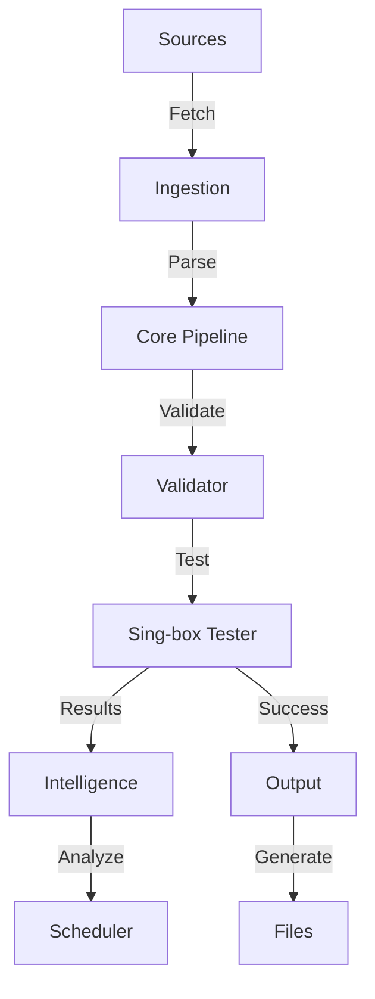

# Architecture Guide

ConfigStream is a high-performance, automated pipeline for aggregating, validating, and distributing proxy configurations.

## System Overview

The system follows a linear pipeline architecture with event-driven observability.

## Core Components

### 1. Ingestion Layer (`fetcher.py`)
- **Async Fetching**: Uses `httpx` for concurrent fetching with HTTP/2 support.
- **Resilience**: Implements Hedged Requests, Circuit Breakers, and Rate Limiting.
- **Memory Protection**: Enforces strict content length limits (50MB) to prevent OOM on CI runners.
- **Deduplication**: Fingerprints configs to avoid duplicate processing.

### 2. Processing Core (`pipeline.py`)
- **Streaming**: Uses `asyncio.Queue` for backpressure management.
- **Parallel Parsing**: Offloads CPU-intensive regex/decoding to a process executor to keep the event loop responsive.
- **Parsing**: `auto_detect.py` identifies protocols (VMess, VLESS, Trojan, Hysteria 2, etc.).
- **Normalization**: Standardizes config formats into a common `Proxy` model.

### 3. Validation & Testing (`testers.py`)
- **Sing-box Core**: Wraps the high-performance Sing-box binary for real connectivity tests.
- **Latency Measurement**: Calculates RTT with jitter penalties.
- **Security Checks**:
    - **MITM**: Checks SSL issuer against known interception tools.
    - **Injection**: Validates HTML content integrity (Honey Pot).
    - **Headers**: Ensures proxy doesn't strip security headers.
    - **TLS Fingerprint**: Verifies resistance to active probing using a Go-based uTLS sidecar.

### 4. Intelligence Layer
Located in `src/configstream/`, this layer optimizes resource usage and reliability.

*   **Anomaly Detection (`anomaly.py`)**:
    *   Uses statistical analysis (Isolation Forest conceptual model) to detect sources with unusual proxy counts.
    *   Prevents "poisoning" attacks where a source floods the system with thousands of bad proxies.
    *   Automatically blocks sources that deviate significantly from their historical baselines.

*   **Source Quality Tracking (`source_quality.py`)**:
    *   Maintains a long-term reputation score for every source URL.
    *   Tracks success rates, latency stability, and "geo-diversity" (Gini index of countries provided).
    *   Prioritizes fetching from high-quality sources during high-load periods.

*   **Adaptive Scheduling (`scheduler.py`)**:
    *   **Smart Retest**: Instead of blindly retesting every proxy every run, it calculates a "Health Score".
    *   **Backoff**: Healthy proxies are retested less frequently (e.g., every 6-12 hours), while unstable ones are checked more often or discarded.

### 5. Unified Frontend (`frontend/`)
The frontend is a single-page application (SPA) served statically via GitHub Pages.

*   **Analytics & Statistics**: Merged into `analytics.html`, providing a comprehensive "Network Intelligence" dashboard.
*   **Data Source**: Consumes `metadata.json` generated by the backend.
*   **Visualizations**: Uses Chart.js for protocol/latency distribution and Leaflet.js for the interactive world map.
*   **PWA**: Fully offline-capable Progressive Web App with a service worker (`sw.js`) handling asset caching.

### 6. Output Generation (`output.py`)
- **Categorization**: Splits proxies by protocol and country.
- **Transport Support**: Fully supports WebSocket, gRPC, and HTTP/2 transports in generated configs.
- **Formats**:
    - **Base64**: Universal subscription.
    - **Clash/Meta**: YAML configs with transport options.
    - **Sing-box**: JSON configs with transport options.
    - **Adapters**: Surge, Loon, Quantumult X, SIP008, and Shadowrocket.

## Data Flow

1. **Trigger**: GitHub Actions schedule (Cron) or manual dispatch.
2. **Fetch**: Sources are downloaded in parallel batches.
3. **Parse**: Content is parsed into `Proxy` objects.
4. **Filter**: Blocklist (IP) and Dedup checks.
5. **Test**:
    - Check Cache -> Return if fresh.
    - Else -> Run Sing-box test.
6. **Enrich**: Add GeoIP data (Country, ASN).
7. **Store**: Update History and Cache.
8. **Publish**: Generate artifacts in `output/`.

## Directory Structure

- `src/configstream/`: Application source code.
- `data/`: GeoIP databases and cache files.
- `output/`: Generated artifacts (publicly served).
- `frontend/`: Static web assets (HTML, CSS, JS).
- `.github/workflows/`: CI/CD definitions.

## Deployment

- **Platform**: GitHub Actions (Runners).
- **Hosting**: GitHub Pages (Static).
- **Database**: SQLite (Ephemeral/Artifact-passed) + JSON Caches.
