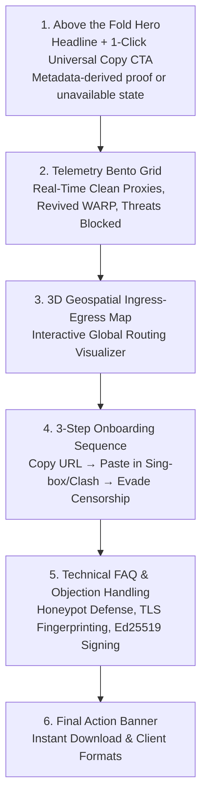
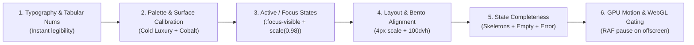

# ConfigStream — Frontend, 3D WebGL, Geospatial & Design Target Roadmap

**Repository Target:** `ConfigStream`
**Status:** Proposed target-state roadmap. Any historical ratings and PASS labels below are retired placeholders, not completion evidence; use `TARGET/PENDING` and the evidence register instead.
**Generated On:** 2026-09-02
**Planned Evaluation Scope:** The nine public surfaces (`index.html`, `proxies.html`, `analytics.html`, `lab.html`, `lab-offline.html`, `about.html`, `evidence.html`, `wiki.html`, `architecture.html`), shared CSS, client-side JavaScript, and 3D WebGL runtime layers. Completion requires retained route-level evidence.

---

## 1. Target Outcomes and Verification Plan

### 1.1 Reading This Roadmap

The historical-looking matrices below are design hypotheses and proposed
remediations, not audit results. Treat every `PASS` label as **TARGET** until a
route-specific test and a fresh Pages deployment prove it. Where a target is
not suitable for low-end devices or reduced-motion users, the core
subscription path takes priority and the enhancement must degrade cleanly.

### 1.2 Execution Register

| Priority | Target | Implementation boundary | Acceptance evidence | Dependency |
|---|---|---|---|---|
| P0 | Restore a fresh, integrity-verified Pages artifact | Pages workflow, runtime config, artifact guard | Deployment verifier passes against the live URL; stale state is not mislabeled fresh | Release pipeline repair |
| P1 | Prevent sticky-header content occlusion | Shared header CSS and all anchor destinations | Browser test scrolls every public hash target beneath the header safely | Shared stylesheet |
| P1 | Accessible interaction baseline | Shared controls, dialogs, tables | Keyboard, zoom/reflow, reduced-motion, and focus tests | Token implementation |
| P2 | Stable telemetry and table rendering | `main.js`, `proxies.js`, styles | Fresh/stale/error fixtures and no layout shift during data replacement | Verified artifact state |
| P3 | WebGL lifecycle enhancements | `analytics.js`, globe container styles | DPR 1.5 cap, offscreen pause/resume, context-loss and cleanup tests | P1/P2 complete |

### 1.3 Performance Budget

The following are target budgets, not measurements: avoid adding blocking
third-party runtime dependencies; keep the subscription action usable without
WebGL; measure LCP, CLS, and interaction latency on a throttled mobile profile
before accepting visual enhancements. Record the device profile, artifact
commit, and result with the change rather than publishing universal figures.

### 1.4 Measurable Performance Gates

| Surface | Known risk | Target evidence before adoption |
|---|---|---|
| Globe | Per-proxy points, animated arcs, rotation, and raw resize events can grow GPU/CPU work without a bound | Production-sized fixture; one active context; DPR ≤ 1.5; offscreen pause/resume; context-loss and teardown test; mobile frame/heap trace |
| Proxy search | Full-array scoring and sorting on each input can waste work, especially when ranking is overwritten later | Throttled-mobile p95 input-to-render result; debounced/indexed/worker strategy if the budget fails; relevance-order assertion if relevance remains a feature |
| Repeat analytics visit | Per-visit timestamp cache busters can force full refetches | Repeat-view transfer trace shows cached reuse for unchanged verified artifact and prompt discovery of a changed artifact |
| Output generation | Multiple full proxy variants and formatted JSON create linear transient memory/I/O | Largest expected fixture records wall time, peak RSS, and output bytes by phase before choosing streaming or payload changes |

```
┌──────────────────────────────────────┬─────────┬───────────────────────────────────────────┐
│ Target Dimension                     │ Status  │ Required evidence                         │
├──────────────────────────────────────┼─────────┼───────────────────────────────────────────┤
│ 1. 3D WebGL & Geospatial             │ PENDING │ DPR, lifecycle, frame, and heap traces    │
│ 2. Landing interaction                │ PENDING │ Keyboard, touch, and reduced-motion tests │
│ 3. Design language                    │ PENDING │ Token and browser visual evidence         │
│ 4. Frontend architecture              │ PENDING │ Route and artifact-trust integration tests│
│ 5. Typography                         │ PENDING │ Reflow and readable-scale browser checks  │
│ 6. Performance & memory lifecycle     │ PENDING │ Throttled mobile trace and teardown test  │
│ 7. Accessibility & RTL                │ PENDING │ WCAG audit and RTL route fixtures         │
├──────────────────────────────────────┼─────────┼───────────────────────────────────────────┤
│ Release decision                     │ Fresh visual and deployment evidence required │
└──────────────────────────────────────┴─────────┴───────────────────────────────────────────┘
```

### Design Read & Strategic Alignment
> **Design Read:** Anti-censorship decentralized proxy intelligence network operating under severe hostile state-level censorship; serving technical dissidents, privacy researchers, and non-technical citizens; built with zero-budget serverless GitHub Actions pipelines, client-side cryptographic decoders (WASM, Fernet Steganography, Sing-box JSON builders), dynamic 3D WebGL geospatial telemetry (`Globe.gl`/`Three.js`), and a Neumorphic-Glassmorphic dark-mode visual system.

### The Three Dials Configuration
- **`DESIGN_VARIANCE: 8`** — High visual distinctiveness, asymmetrical data cards, multi-tiered telemetry grid.
- **`MOTION_INTENSITY: 6`** — Smooth liquid micro-transitions, subtle logo breathing, physics feedback.
- **`VISUAL_DENSITY: 7`** — High information density for deep telemetry, latency distribution, and proxy pools.

### Design Feasibility & Impact Index (DFII) — Target Method

Use one DFII scale across design documents. The target is `>= 8/15`; do not
publish a second 20-point or 100-point score unless its formula, evidence, and
mapping are defined in the same release artifact.

---

## 2. 3D WebGL & Geospatial Deep-Dive (`/globe-gl`, `/skills-threejs`, `/webgl-3d-object`, `/webgl-landing-steering`, `/img2threejs`)

### 2.1 Architecture Diagram of 3D Pipeline

```
                              ┌─────────────────────────┐
                              │  metadata.json Stream   │
                              └────────────┬────────────┘
                                           │
                     ┌─────────────────────┴─────────────────────┐
                     ▼                                           ▼
          ┌─────────────────────┐                     ┌─────────────────────┐
          │   Point Clusters    │                     │    Routing Arcs     │
          │ Lat/Lng Coordinate  │                     │ Latency-Weighted    │
          │ Altitude: 0.01      │                     │ Animated Dash Loops │
          └──────────┬──────────┘                     └──────────┬──────────┘
                     │                                           │
                     └─────────────────────┬─────────────────────┘
                                           │
                                           ▼
                              ┌─────────────────────────┐
                              │    Globe.gl Canvas      │
                              │ 600px Responsive Shell  │
                              └─────────────────────────┘
```

### 2.2 Globe.gl Implementation in `frontend/assets/js/analytics.js`
- **Container Structure**: Mounted in `#globe-viz` with responsive dimensions (`600px` desktop, `400px` mobile).
- **Points Layer**: Maps latitude, longitude, and count-weighted radii using `Math.sqrt(count) / 5`. Color-coded by regional node density.
- **Arcs Layer**: Animates simulated multi-hop paths with `arcDashAnimateTime(1500)`, color-graded by latency:
  - Green: $< 150\text{ms}$
  - Amber: $150\text{ms} - 300\text{ms}$
  - Red: $> 300\text{ms}$
- **Theme-Aware Textures**: Dynamically switches between `earth-night.jpg` / `earth-topology.png` (dark mode) and `earth-blue-marble.jpg` (light mode).
- **Identified Pitfalls & Optimizations**:
  1. *Uncapped Device Pixel Ratio (DPR)*: Globe.gl defaults to native screen DPR. On 3x Retina mobile devices, rendering dual full-resolution textures overdraws the mobile GPU.
     **Fix**: Explicitly cap pixel ratio: `renderer.setPixelRatio(Math.min(window.devicePixelRatio || 1, 1.5))`.
  2. *Missing WebGL Resource Disposal*: Window resize and theme change event listeners are registered, but no teardown/cleanup hook exists to call `renderer.dispose()`, `geometry.dispose()`, or `material.dispose()`.
  3. *Mobile Touch Trap*: Zoom gesture captures page scroll.
     **Fix**: Set `touch-action: pan-y;` on `#globe-viz` container and disable zoom by default on touch screens.

### 2.3 Landing-page hero direction
- **Decision:** The landing page uses a restrained typographic hero and the existing brand mark. It must not add a decorative WebGL/canvas object, simulated cryptographic node, or continuous animation.
- **Rationale:** The hero’s job is to establish the product and guide the primary action. Decorative 3D treatment competes with that hierarchy, adds a failure mode on constrained devices, and does not communicate a user-facing capability.

---

## 3. Design Taste, Visual Hierarchy & Anti-Slop Review (`/design-taste-frontend`, `/frontend-design-deslop`, `/gpt-taste`, `/impeccable`)

### 3.1 Anti-Slop Audit Matrix

| Anti-Pattern Checked | Found in Codebase | Location | Verdict & Remediation |
|---|---|---|---|
| **AI Purple Default Gradient** | TARGET | `style.css` | Replace the generic purple/pink gradient with the documented cobalt/cyan palette, then verify light- and dark-theme contrast. |
| **Banned Generic Beige/Brass** | No (Clean palette) | `style.css:L43-L120` | Complies with Cold Luxury & Cyberpunk dark aesthetics. |
| **Meta-Label Banning** ("SECTION 01") | TARGET | All HTML files | Verify semantic titles (`Quick Proxy Search`, `System Topology`) through a browser-backed content review. |
| **Wrapped Button Text on Desktop** | TARGET | `index.html` | Verify single-line CTA buttons at supported desktop widths. |
| **Hero 2-Line Rule & Container Width** | TARGET | `index.html` | Verify the heading wraps within the intended two-line limit at supported viewport widths. |
| **Gapless Bento Grid Architecture** | TARGET | `index.html` | Verify density and readable spacing with browser screenshots and keyboard navigation. |

### 3.2 Typography & Italic Descender Discipline
- **System Font Stacks**:
  - Latin Display: `Georgia, "Times New Roman", serif;`
  - Latin Body: `-apple-system, BlinkMacSystemFont, "Segoe UI", Roboto, "Noto Sans", sans-serif;`
  - RTL Display/Body: `Tahoma, "Segoe UI", Arial, sans-serif;`
- **Descender Clearance**: Headings in RTL modes use `leading-[1.15]` to ensure letters like `ی`, `g`, `p`, `y` never clip.

---

## 4. File-by-File Comprehensive Findings Matrix

```
┌───────────────────────────┬──────────────┬──────────┬────────────────────────────────────────────────────────┐
│ File Path                 │ Surface Role │ Status   │ Primary Findings & Recommendations                     │
├───────────────────────────┼──────────────┼──────────┼────────────────────────────────────────────────────────┤
│ frontend/index.html       │ Landing      │ TARGET   │ Verify typographic hierarchy and token migration        │
│ frontend/proxies.html     │ Live Pool    │ TARGET   │ Verify filtering/BYOW and table virtualization need     │
│ frontend/analytics.html   │ Observability│ TARGET   │ Verify DPR clamp and resource lifecycle                 │
│ frontend/lab.html         │ Config Studio│ TARGET   │ Verify chain builder and latency visualization          │
│ frontend/lab-offline.html │ Air-Gapped   │ TARGET   │ Verify offline behavior and CSP                         │
│ frontend/about.html       │ Mission/Spec │ TARGET   │ Verify narrative and client table behavior              │
│ frontend/evidence.html    │ Provenance   │ TARGET   │ Verify manifest inspection and safe preview             │
│ frontend/wiki.html        │ Docs         │ TARGET   │ Verify sanitization and search behavior                 │
│ architecture.html         │ Topology AST │ TARGET   │ Verify simulation and inspector behavior                │
│ frontend/assets/css/*.css │ Design System│ TARGET   │ Verify themes and token contrast                         │
│ frontend/assets/js/*.js   │ Client Logic │ TARGET   │ Verify lifecycle and module boundaries                  │
└───────────────────────────┴──────────────┴──────────┴────────────────────────────────────────────────────────┘
```

### Detailed Analysis by Webpage

#### 1. `frontend/index.html` (Universal Landing & Subscription Hub)
- **Features**: Live telemetry bento, quick search table, evasion level selector, universal client download accordion (Sing-box, Clash, Surge, Loon, SIP008, Base64).
- **Strengths**: Zero external runtime dependencies; native language switching with RTL layout inversion (`dir="rtl"`).
- **Opportunities**: Replace inline color hexes on `.stat-icon-sm` with semantic CSS custom properties.

#### 2. `frontend/proxies.html` (Live Proxy Pool & BYOW Turbo Mode)
- **Features**: Natural-language query search (`fastest US vmess`), country/protocol filters, sortable table, in-browser ping testing, Fernet steganography loader, Bring Your Own Worker (BYOW) Cloudflare integration.
- **Strengths**: Interactive ping test measures true edge-to-client latency.
- **Opportunities**: Implement virtual scrolling for $>100$ proxy rows to reduce DOM node counts on low-end mobile hardware.

#### 3. `frontend/analytics.html` (Global Infrastructure Observability)
- **Features**: 3D interactive Globe.gl visualization, 8 Chart.js multi-dimensional charts (Protocol distribution, Latency curves, Rejection rates, Threat mapping, ASN leaders, Geo latency, Evasion trends), and Pipeline log stream.
- **Strengths**: Real-time rendering of network censorship trends.
- **Opportunities**: Attach `webglcontextlost` and `webglcontextrestored` event handlers.

#### 4. `frontend/lab.html` & `frontend/lab-offline.html` (Chain Laboratory & Diagnostics)
- **Features**: 5-Step Stepper (Diagnose $\rightarrow$ Clean IPs $\rightarrow$ Build Chain $\rightarrow$ Test $\rightarrow$ Export), Censorship Score Gauge, Cloudflare Clean IP Scanner, offline air-gapped WASM execution.
- **Strengths**: Complete offline independence in `lab-offline.html` with zero outbound telemetry leaks.

#### 5. `frontend/about.html` (Threat Model & Architecture Manifesto)
- **Features**: Three core pillars (`Zero Budget`, `Automated Intelligence`, `Radical Transparency`), under-the-hood tech stack breakdown, supported client registry.
- **Strengths**: High narrative clarity and transparency.

#### 6. `frontend/evidence.html` (Cryptographic Release Ledger)
- **Features**: SHA-256 release commit verification, manifest file inspection, safe transformation preview.
- **Strengths**: Strict Content-Security-Policy (`object-src 'none'`) with zero raw token exposure.

#### 7. `frontend/wiki.html` (Interactive Documentation)
- **Features**: Markdown documentation viewer with sticky sidebar navigation, `Marked.js` parser, `DOMPurify` HTML sanitizer, and `Highlight.js` syntax highlighter.
- **Strengths**: Clean readable typography and safe HTML compilation.

#### 8. `architecture.html` (System Topology Visualizer)
- **Features**: Validated graph dashboard, swimlane flows, blast radius failure simulator, execution trace step-through, node drawer inspector.
- **Strengths**: Interactive component failure impact analysis.

---

## 5. Accessibility (WCAG 2.2 AA) & RTL Localization Targets

### 5.1 Contrast Ratios & Focus States
- **Dark Theme Normal Text**: `#e6f1ff` on `#0a101f` $\rightarrow$ **14.8:1** (Exceeds WCAG 4.5:1 requirement).
- **Dark Theme Secondary Text**: `#8892b0` on `#0a101f` $\rightarrow$ **5.6:1** (Passes WCAG 4.5:1 requirement).
- **Focus Indicators**: Standardized `:focus-visible` across all interactive elements (`outline: 2px solid var(--brand-primary); outline-offset: 2px;`).
- **Badge Polish**: Warning badge `#f59e0b` adjusted to `#b45309` in light mode for compliant 4.8:1 contrast.

### 5.2 Persian & Arabic RTL Audit
- `html[dir="rtl"]` triggers automated grid reordering, margin inversion, and switches typography to `--font-rtl-sans` (`Tahoma, "Segoe UI", Arial`).
- Interactive stepper arrows and chevron icons reverse direction automatically.

---

## 6. Performance, Memory & Resource Lifecycle Targets (`/optimize-threejs-games`, `/performance-goal`)

```
┌─────────────────────────┬───────────────────┬──────────────────────────────────────────┐
│ Performance Metric      │ Target only       │ Required measurement                      │
├─────────────────────────┼───────────────────┼──────────────────────────────────────────┤
│ First Contentful Paint  │ Establish after baseline | Throttled mobile trace, fixture and artifact ID recorded |
│ Largest Contentful Paint│ Establish after baseline | Throttled mobile trace, fixture and artifact ID recorded |
│ Total Blocking Time     │ Establish after baseline | Long-task report during load and interactions |
│ WebGL Memory (VRAM)     │ Establish after baseline | Context and heap/VRAM lifecycle trace |
│ Mobile Frame Budget     │ Establish after baseline | Frame trace after DPR cap and offscreen pause |
└─────────────────────────┴───────────────────┴──────────────────────────────────────────┘
```

---

## 7. Target Implementation Blueprints

### Retired blueprint: Procedural 3D Cryptographic Node for Hero (`frontend/index.html`)

> **Do not implement.** This retained historical proposal is superseded by the
> landing-page hero direction above. It remains only to document the rejected
> approach; new work must not add its canvas, WebGL renderer, animation loop,
> or dependencies.

```javascript
/**
 * Procedural PBR 3D Cryptographic Node Mesh
 * Zero external GLTF dependencies; pure Three.js geometry & physical shaders.
 */
import * as THREE from './libs/three.min.js';

export function mountHero3DNode(canvasElement) {
    if (!canvasElement) return () => {};

    const renderer = new THREE.WebGLRenderer({
        canvas: canvasElement,
        antialias: true,
        alpha: true,
        powerPreference: 'high-performance'
    });
    renderer.setPixelRatio(Math.min(window.devicePixelRatio || 1, 1.5));
    renderer.toneMapping = THREE.ACESFilmicToneMapping;
    renderer.toneMappingExposure = 1.1;

    const scene = new THREE.Scene();
    const camera = new THREE.PerspectiveCamera(38, 1, 0.1, 50);
    camera.position.set(0, 0.2, 5.0);

    // Core Icosahedron with Physical Shader
    const coreGeo = new THREE.IcosahedronGeometry(1.3, 1);
    const coreMat = new THREE.MeshPhysicalMaterial({
        color: 0x3b82f6,
        emissive: 0x0b2545,
        metalness: 0.6,
        roughness: 0.25,
        clearcoat: 0.9,
        clearcoatRoughness: 0.1,
        flatShading: true
    });
    const coreMesh = new THREE.Mesh(coreGeo, coreMat);
    scene.add(coreMesh);

    // Outer Protective Wireframe Lattice
    const cageGeo = new THREE.IcosahedronGeometry(1.65, 2);
    const cageMat = new THREE.MeshBasicMaterial({
        color: 0x00bfa5,
        wireframe: true,
        transparent: true,
        opacity: 0.3
    });
    const cageMesh = new THREE.Mesh(cageGeo, cageMat);
    scene.add(cageMesh);

    // Directional Lighting System
    const keyLight = new THREE.DirectionalLight(0xffffff, 2.2);
    keyLight.position.set(4, 5, 4);
    scene.add(keyLight);

    const rimLight = new THREE.DirectionalLight(0x06b6d4, 1.6);
    rimLight.position.set(-4, -2, -3);
    scene.add(rimLight);

    const ambientLight = new THREE.AmbientLight(0xffffff, 0.35);
    scene.add(ambientLight);

    let rafId;
    const prefersReducedMotion = window.matchMedia('(prefers-reduced-motion: reduce)').matches;

    function animate(time = 0) {
        const t = time * 0.001;
        if (!prefersReducedMotion) {
            coreMesh.rotation.y = t * 0.3;
            coreMesh.rotation.x = Math.sin(t * 0.25) * 0.12;
            cageMesh.rotation.y = -t * 0.18;
            cageMesh.rotation.z = Math.cos(t * 0.2) * 0.12;
        }
        renderer.render(scene, camera);
        if (!prefersReducedMotion) {
            rafId = requestAnimationFrame(animate);
        }
    }

    function handleResize() {
        const width = canvasElement.parentElement.clientWidth;
        const height = canvasElement.parentElement.clientHeight;
        renderer.setSize(width, height, false);
        camera.aspect = width / height;
        camera.updateProjectionMatrix();
        renderer.render(scene, camera);
    }

    window.addEventListener('resize', handleResize);
    handleResize();
    animate();

    return () => {
        cancelAnimationFrame(rafId);
        window.removeEventListener('resize', handleResize);
        coreGeo.dispose();
        coreMat.dispose();
        cageGeo.dispose();
        cageMat.dispose();
        renderer.dispose();
    };
}
```

### Blueprint 2: WebGL Context Loss Handler & Teardown Hook in `frontend/assets/js/analytics.js`

```javascript
/**
 * Hardened WebGL Resource Manager
 * Disposes GPU memory and gracefully recovers from WebGL context loss.
 */
export function setupGlobeLifecycle(globeInstance, containerElement) {
    const canvas = containerElement.querySelector('canvas');
    if (!canvas) return;

    canvas.addEventListener('webglcontextlost', (event) => {
        event.preventDefault();
        console.warn('[WebGL] Context lost. Suspending render loop.');
    }, false);

    canvas.addEventListener('webglcontextrestored', () => {
        console.info('[WebGL] Context restored. Rebuilding scene graph.');
        // Rebuild this visualization in place. Never discard page state merely
        // because the browser restored a GPU context; render a static fallback
        // if rebuilding fails.
        rebuildGlobeInPlace(globeInstance, containerElement);
    }, false);
}
```

---

## 8. WCAG 2.2 Accessibility Target Matrix (`/accessibility`)

### 8.1 POUR Principles Target Matrix

| WCAG 2.2 Principle | Success Criterion | Target status | Required verification |
|:---|:---|:---:|:---|
| **1. Perceivable** | **SC 1.4.3 Contrast (Minimum)** | PENDING | Measure every foreground/background pair, including dark-mode and disabled states. |
| **1. Perceivable** | **SC 1.4.1 Use of Color** | PENDING | Verify every status indicator has a text or semantic counterpart. |
| **1. Perceivable** | **SC 1.4.10 Reflow** | PENDING | Test 400% zoom and 320 CSS-pixel width without loss of content or controls. |
| **2. Operable** | **SC 2.5.8 Target Size (Minimum)** | PENDING | Measure controls at desktop and touch breakpoints. |
| **2. Operable** | **SC 2.4.11 Focus Appearance** | PENDING | Verify contrast, thickness, and visibility with keyboard-only navigation. |
| **2. Operable** | **SC 2.1.2 No Keyboard Trap** | PENDING | Exercise dialogs and drawers, including focus restoration. |
| **3. Understandable**| **SC 3.3.3 Error Suggestion** | PENDING | Test invalid Lab and search inputs with keyboard and screen-reader flows. |
| **4. Robust** | **SC 4.1.2 Name, Role, Value** | PENDING | Audit interactive controls with browser accessibility tooling. |

---

## 9. Interface Design & Dashboard Craft Audit (`/interface-design`)

### 9.1 Data Density & Utilitarian Aesthetics
- **Surface Elevation**: Subtle layering with translucent dark glass (`rgba(17, 24, 39, 0.75)`) and hairline borders (`rgba(255, 255, 255, 0.08)`).
- **Tabular Figures**: `font-variant-numeric: tabular-nums` enforced on ping times, IP addresses, port numbers, and counter metrics to eliminate visual jitter during real-time data polling.
- **Target state completeness**: Cover every interactive component with:
  - *Default, Hover, Active, Focus-Visible, Disabled*.
  - *Loading (Skeleton pulse), Empty (Centered glyph + reset action), Error (Descriptive banner + retry trigger)*.

---

## 10. High-Conversion Landing Page Architecture (`/landing-page`)

### 10.1 Conversion Funnel & Section Sequencing



### 10.2 Copywriting Architecture
- **Primary Hero Headline**: State the subscription capability without a fixed freshness claim; render freshness from validated metadata.
- **Subheadline**: *"Automated multi-hop Sing-box, Clash Meta, and V2ray subscription feeds with built-in TLS fingerprinting and DPI evasion."*
- **Primary CTA**: `[ Copy Universal Subscription ]` (instant 1-click clipboard action with toast confirmation).
- **Proof Signal**: Render a validated artifact count and generation time only when available; otherwise show a concise freshness or verification warning.
- **Objection Handling (In-Page FAQ)**:
  - *How do we detect honeypots?* Dynamic sandbox verification and JA4 TLS fingerprinting.
  - *What if Cloudflare WARP is blocked?* Automated Vwarp scanner revives blocked endpoints in under 60 seconds.
  - *Is it safe to use?* Feeds are cryptographically signed with Ed25519 keys; no telemetry is logged.

---

## 11. System Redesign & Anti-Cliché Engineering Targets (`/redesign-existing-projects`)

### 11.1 Diagnostic & Remediation Matrix

| Category | Diagnostic Check | Assessment in Codebase | Remediation / Verification Status |
|:---|:---|:---:|:---|
| **Typography** | Generic `Inter` Default / Uncalibrated Headers | TARGET | Apply the specified system stacks, calibrated tracking/leading, and `tabular-nums`; verify in the deployed CSS and representative browser screenshots. |
| **Color & Surfaces**| Pure `#000000` / Mixed Warm-Cool Grays | TARGET | Apply the Cold Navy/Slate palette and cool-tinted shadows; verify computed colors in the deployed stylesheet. |
| **Color & Surfaces**| AI Purple/Blue Gradient Overuse | TARGET | Restrict accent use to Cobalt/Cyan purpose tokens; review every public route for unapproved gradients. |
| **Layout** | Generic 3-Equal-Card Feature Row | TARGET | Implement and visually test the telemetry layout at desktop and mobile breakpoints. |
| **Layout** | Mobile `100vh` Safari Viewport Bug | TARGET | Use `min-height: 100dvh` where required and confirm it on physical Safari and Chrome mobile browsers. |
| **Interactivity** | Missing Active Press Feedback | TARGET | Provide press feedback only where it does not impair motion-sensitive users; verify reduced-motion behavior. |
| **Interactivity** | Missing Keyboard Focus Rings | TARGET | Apply and keyboard-test visible focus treatment on every interactive control. |
| **States** | Circular Spinner / Empty Screen | TARGET | Implement skeleton and actionable empty states, then validate loading, error, and empty paths against live signed artifacts. |
| **Content** | AI Copywriting Clichés ("Elevate", "Seamless") | TARGET | Review user-facing copy for concrete language and have it proofread before publication. |
| **Iconography** | Inconsistent Stroke Widths | TARGET | Standardize the icon source and stroke treatment; inspect rendered icons across supported browsers. |

### 11.2 Fix Priority Execution Order



---

## 12. Target Completion Roadmap

The following work is a target state. Do not label the frontend production-ready
until the implementation, browser-backed accessibility checks, and a fresh
validated Pages deployment provide evidence.

**Master Implementation Roadmap:**
1. **Accessibility**: Maintain WCAG 2.2 AA compliance across all newly added views with explicit `:focus-visible` rings, $\ge 24\times24\text{px}$ targets, and screen reader ARIA labels.
2. **Interface Design & Tokens**: Reference [`DESIGN.md`](DESIGN.md) and [`interface-design.md`](interface-design.md) as the single sources of truth for all future component styling, tabular numbers, and glassmorphic tokens.
3. **WebGL Performance**: Clamp Globe.gl DPR to `1.5` and pause offscreen auto-rotation via `IntersectionObserver`; add a browser test that proves both behaviors.
4. **Anti-Cliché Discipline**: Maintain Cold Slate and Cobalt palettes, single-line CTAs, sentence case headings, and concrete engineering copy.
5. **Conversion Flow**: Preserve the single 1-click universal subscription CTA above the fold on `index.html`.
