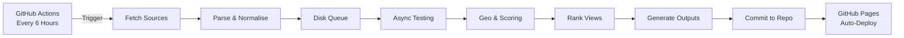

# ConfigStream

🚀 **Automated Free VPN Configuration Aggregator**

[](https://github.com/AmirrezaFarnamTaheri/ConfigStream/actions/workflows/pipeline.yml)
[](https://www.gnu.org/licenses/gpl-3.0)
[](https://www.python.org/downloads/)

ConfigStream automatically collects, tests, and publishes working VPN configurations from free public sources. All configurations are automatically tested and updated every 6 hours via GitHub Actions. This process includes comprehensive security testing and geolocation data.

## 🌐 Get Fresh Configurations

Visit our GitHub Pages site to download the latest tested configurations:

### **👉 [https://amirrezafarnamtaheri.github.io/ConfigStream/](https://amirrezafarnamtaheri.github.io/ConfigStream/)**

## ✨ Features

### 🤖 Fully Automated
- **Automated Updates Every 6 Hours** via GitHub Actions
- **Zero manual intervention** required
- **Cache-busting** ensures clients always get fresh data
- **668+ curated sources** from public repositories and Telegram channels
- **Multi-protocol collection** from diverse geographic regions

### 🔒 Comprehensive Security Testing
- **Content injection detection** - Filters out proxies that modify page content
- **SSL/TLS validation** - Ensures secure HTTPS connections
- **Header preservation** - Verifies proxies don't strip important headers
- **Redirect handling** - Tests proper HTTP redirect behavior
- **Port scanning prevention** - Removes suspicious open ports

### 🌍 Rich Geolocation Data
- **Country and city** information for each proxy
- **ASN (Autonomous System Number)** details
- **Network provider** identification
- **Geographic sorting** and filtering capabilities

### ⚡ Performance Optimized
- **Latency testing** for all proxies
- **Automatic sorting** by ping time
- **Concurrent testing** with configurable workers
- **Failed proxy filtering**

### 📊 Advanced Analytics
- **Interactive proxy viewer** with filtering
- **Detailed statistics** with charts
- **Protocol distribution** analysis
- **Country distribution** visualization
- **Export capabilities** (CSV, JSON)

### 📦 Multiple Output Formats
- **Canonical JSON** - `output/proxies.json` with the full tested dataset
- **Ranked views** - `proxies_balanced.json`, `proxies_speed.json`, `proxies_privacy.json`, `proxies_stability.json`
- **Rich metadata** - `output/metadata.json` with run statistics and warnings
- **Audit trail** - `output/rejections.jsonl` for transparent filtering decisions

## 🔧 How It Works



### Pipeline Steps:

1. **Fetch** - HTTP/2 client with ETag/Last-Modified caching per source
2. **Parse** - Canonicalise endpoints and compute stable proxy identifiers
3. **Queue** - Persist every entry to a SQLite-backed disk queue (no in-memory caps)
4. **Test** - Sing-box verification with latency budgets and retry heuristics
5. **Secure** - Security testing with detailed issue tracking and categorization
6. **Geolocate** - Offline GeoIP lookup with DNS caching (no external token)
7. **Score** - Compute balanced, speed, privacy, and stability rankings
8. **Generate** - Emit canonical + ranked JSON outputs with metadata
9. **Publish** - Commit and deploy to GitHub Pages without failing when output exists

## 📥 Available Formats

### 1. Base64 Subscription
Universal format compatible with:
- V2RayNG (Android)
- V2Box / Shadowrocket (iOS)
- V2Ray Desktop clients

**Usage:** Paste the subscription link into your client

**⭐ Chosen Top 1000** (Recommended for most users):
```
https://amirrezafarnamtaheri.github.io/ConfigStream/output/chosen/base64.txt
```

**All Configs** (Full collection):
```
https://amirrezafarnamtaheri.github.io/ConfigStream/output/base64.txt
```

### 2. Clash Configuration
Ready-to-use YAML for:
- Clash for Windows
- ClashX (macOS)
- Clash Meta / Clash Verge
- Clash Android

**Usage:** Download and import the YAML file
```
https://amirrezafarnamtaheri.github.io/ConfigStream/output/full/clash.yaml
```

### 3. Raw Configs
Unencoded configuration links for:
- Manual import
- Advanced users
- Custom scripts

**Usage:** One proxy configuration per line
```
https://amirrezafarnamtaheri.github.io/ConfigStream/output/all.txt
```

### 4. JSON Data
Detailed information including:
- Protocol, country, city, ASN
- Latency and performance metrics
- Security test results
- Full configuration strings

## 🛡️ Security Notice

**IMPORTANT:** These are free public VPN nodes from unknown operators.

### ❌ NOT Suitable For:
- Banking or financial transactions
- Accessing sensitive personal information
- Confidential business communications
- Medical or legal matters
- Any activity requiring guaranteed privacy

### ✅ Good For:
- Casual web browsing
- Bypassing geo-restrictions
- Accessing blocked content
- Testing and development

### 🔐 Best Practices:
- **Always use HTTPS websites** when possible
- **Never enter passwords** for important accounts
- **Avoid sensitive activities** entirely
- **Use trusted VPN services** for critical needs
- **Be aware** that traffic may be logged or modified

**Use at your own risk. No warranties provided.**

## 💻 Local Development

### Prerequisites

- Python 3.10 or higher
- pip
- Git

### Installation

```bash
# Clone the repository
git clone https://github.com/AmirrezaFarnamTaheri/ConfigStream.git
cd ConfigStream

# Install in development mode
pip install -e .

# Install development dependencies
pip install -e ".[dev]"
```

### Usage

```bash
# Basic usage - fetch, test, and generate
configstream merge --sources sources.txt --output output/

# With filters
configstream merge \
  --sources sources.txt \
  --output output/ \
  --country US \
  --max-latency 500 \
  --max-workers 20

# Update GeoIP databases
configstream update-databases

# Show help
configstream --help
```

### Available Options

```
--sources          Path to sources file (required)
--output           Output directory (default: output/)
--max-proxies      Maximum number of proxies to test
--country          Filter by country code (e.g., US, DE)
--min-latency      Minimum latency in milliseconds
--max-latency      Maximum latency in milliseconds
--max-workers      Number of concurrent workers (default: 10)
--timeout          Timeout per test in seconds (default: 10)
```

## 📁 Project Structure

```
ConfigStream/
├── .github/
│   └── workflows/
│       └── pipeline.yml           # GitHub Actions workflow
├── src/
│   └── configstream/
│       ├── cli.py                 # Command-line interface
│       ├── core.py                # Core proxy testing logic
│       ├── pipeline.py            # Main processing pipeline
│       ├── config.py              # Configuration management
│       └── logo.svg               # Project logo
├── output/                        # Generated configs (auto-updated)
│   ├── base64.txt                 # All configs in base64 format
│   ├── all.txt                    # Raw proxy links
│   ├── chosen/                    # Top 1000 curated proxies
│   │   └── base64.txt             # Best selection, ranked by latency
│   ├── full/                      # Additional formats
│   │   └── clash.yaml             # Clash configuration
│   ├── proxies.json               # Detailed proxy data
│   ├── statistics.json            # Aggregate statistics
│   └── metadata.json              # Update metadata
├── data/                          # GeoIP databases
├── tests/                         # Test suite
├── sources.txt                    # Source URLs
├── index.html                     # Main landing page
├── proxies.html                   # Proxy viewer
├── statistics.html                # Statistics page
├── pyproject.toml                 # Project configuration
└── README.md                      # This file
```

## 📊 Supported Protocols

ConfigStream supports **20+ VPN protocols** for comprehensive configuration collection:

### Core Protocols
- ✅ **VMess** - V2Ray's original protocol with multiple transport options
- ✅ **VLESS** - Lightweight V2Ray protocol (including REALITY support)
- ✅ **Shadowsocks (SS)** - Fast and secure SOCKS5 proxy with AEAD ciphers
- ✅ **Shadowsocks 2022 (SS2022)** - Modern Shadowsocks standard with improved security
- ✅ **ShadowsocksR (SSR)** - Enhanced Shadowsocks with obfuscation
- ✅ **Trojan** - TLS-based proxy protocol for censorship circumvention
- ✅ **Trojan-Go** - Enhanced Trojan with WebSocket support

### High-Performance Protocols
- ✅ **Hysteria** - UDP-based high-performance protocol (v1)
- ✅ **Hysteria2 (HY2)** - Next-generation Hysteria with improved congestion control
- ✅ **TUIC** - QUIC-based proxy protocol for low-latency connections
- ✅ **WireGuard** - Modern, fast VPN protocol with minimal attack surface

### Advanced Protocols
- ✅ **XRay** - Enhanced V2Ray core with performance optimizations
- ✅ **XTLS** - Extreme TLS with vision and splice modes
- ✅ **Naive** - Censorship-resistant proxy based on Chromium network stack
- ✅ **Snell** - Surge-designed high-performance protocol
- ✅ **Brook** - Simple cross-platform proxy protocol
- ✅ **Juicity** - Modern QUIC-based protocol

### Traditional Protocols
- ✅ **HTTP/HTTPS** - Standard HTTP proxies with CONNECT support
- ✅ **SOCKS4/SOCKS5** - Classic SOCKS proxy protocols
- ✅ **SSH** - SSH tunneling support

## 🧪 Testing

```bash
# Run all tests
pytest

# Run with coverage
pytest --cov=configstream

# Run specific test file
pytest tests/test_core.py

# Run with verbose output
pytest -v
```

## 🔄 Automation Details

### GitHub Actions Workflow

The automation workflow (`pipeline.yml`) runs:
- **Every 6 hours** (at 00:00, 06:00, 12:00, 18:00 UTC) to fetch, test, and merge proxies from all sources.
- **On manual trigger** via workflow_dispatch.
- **On source file changes** (e.g., updates to `sources.txt`).

### Workflow Steps:
1. Checkout repository
2. Set up Python environment
3. Install dependencies
4. Download GeoIP databases
5. Run merge pipeline
6. Generate all output formats
7. Create metadata with cache-busting
8. Commit changes to repository
9. GitHub Pages auto-deploys

### Performance:
- Tests 1000+ configurations in ~30 minutes
- Concurrent testing with 10-20 workers
- Automatic retry for failed sources
- Efficient caching to avoid redundant tests

## 🤝 Contributing

Contributions are welcome! Here's how you can help:

### Adding New Sources

We welcome community contributions of high-quality configuration sources!

**Current Sources:** 668+ URLs across 6 batch files, including:
- GitHub repositories with automated updates
- Telegram channel collectors
- Protocol-specific aggregators
- Country-specific configuration lists

**To Add New Sources:**
1. Fork the repository
2. Add URLs to appropriate `sources/batch_*.txt` file (one per line)
3. Ensure sources provide raw configuration strings (not web pages)
4. Preferred sources:
   - Auto-updating repositories (updates every 15-60 minutes)
   - Protocol-specific splits (vmess, vless, trojan, etc.)
   - Verified and tested configurations
5. Test locally: `configstream merge --sources sources/batch_1.txt`
6. Submit a pull request with source description

**Source Quality Guidelines:**
- ✅ Direct raw.githubusercontent.com URLs
- ✅ Regularly updated (at least daily)
- ✅ Multiple protocols supported
- ✅ Base64 or plain text format
- ❌ Avoid HTML pages or login-required sources
- ❌ Avoid single-config sources (prefer bulk lists)

### Reporting Issues

- Use [GitHub Issues](https://github.com/AmirrezaFarnamTaheri/ConfigStream/issues)
- Include relevant details (OS, Python version, error messages)
- Check if the issue already exists

### Feature Requests

- Open an issue with the "enhancement" label
- Describe the feature and use case
- Discuss implementation approach

### Code Contributions

1. Fork the repository
2. Create a feature branch: `git checkout -b feature/amazing-feature`
3. Make your changes
4. Run tests: `pytest`
5. Commit: `git commit -m 'Add amazing feature'`
6. Push: `git push origin feature/amazing-feature`
7. Open a pull request

## 📝 License

This project is licensed under the GNU General Public License v3.0. See the [LICENSE](LICENSE) file for details.

### What This Means:
- ✅ You can use, modify, and distribute this software
- ✅ You must include the license and copyright notice
- ✅ Any modifications must also be GPL-3.0
- ✅ Source code must be made available
- ❌ No warranty is provided

## 🙏 Acknowledgments

- **Free VPN Providers** - Thanks to all who share configurations publicly
- **Open Source Community** - For the amazing tools and libraries
- **GitHub** - For free hosting and automation
- **Contributors** - Everyone who helps improve the project

### Technologies Used:
- [Python](https://www.python.org/) - Core application
- [Sing-Box](https://sing-box.sagernet.org/) - Proxy testing backend
- [GeoIP2](https://dev.maxmind.com/geoip/geolite2-free-geolocation-data) - Geolocation data
- [GitHub Actions](https://github.com/features/actions) - Automation
- [GitHub Pages](https://pages.github.com/) - Static hosting
- [Chart.js](https://www.chartjs.org/) - Data visualization
- [DataTables](https://datatables.net/) - Interactive tables

## 📞 Support

- 🐛 **Report Bugs:** [GitHub Issues](https://github.com/AmirrezaFarnamTaheri/ConfigStream/issues)
- 💡 **Request Features:** [GitHub Issues](https://github.com/AmirrezaFarnamTaheri/ConfigStream/issues)
- 📖 **Documentation:** [GitHub Pages](https://amirrezafarnamtaheri.github.io/ConfigStream/)
- ⭐ **Star the Project:** [GitHub Repository](https://github.com/AmirrezaFarnamTaheri/ConfigStream)

## 📈 Statistics


---

<p align="center">
  <strong>Made with ❤️ for internet freedom</strong>
  <br>
  <sub>Educational purposes only • Use responsibly</sub>
</p>