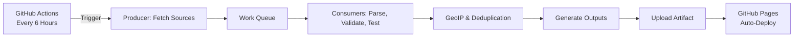

# ConfigStream

🚀 **Automated Free VPN Configuration Aggregator**

[](https://github.com/AmirrezaFarnamTaheri/ConfigStream/actions/workflows/pipeline.yml)
[](https://www.gnu.org/licenses/gpl-3.0)
[](https://www.python.org/downloads/)

ConfigStream is a high-performance, fully automated system that collects, tests, and publishes working VPN configurations from free public sources. All configurations are automatically tested and updated every 6 hours via GitHub Actions, with a focus on security, performance, and data integrity.

## 🌐 Get Fresh Configurations

Visit our GitHub Pages site to download the latest tested configurations:

### **👉 [https://amirrezafarnamtaheri.github.io/ConfigStream/](https://amirrezafarnamtaheri.github.io/ConfigStream/)**

## ✨ Features

- **🤖 Fully Automated:** Runs every 6 hours via GitHub Actions, requiring zero manual intervention.
- **🛡️ Secure by Default:**
    - **Strict Validation:** Rejects proxies with insecure configurations, private IP addresses, or dangerous ports.
    - **Secure Testing:** Uses isolated environments to test proxies, with robust cleanup to prevent resource leaks.
- **⚡ High-Performance:**
    - **Streaming Architecture:** Processes large source lists with a constant, low memory footprint.
    - **Smart Networking:** Uses hedged requests, adaptive timeouts, and AIMD concurrency control to maximize throughput.
- **🧠 Intelligent Scheduling:**
    - **Smart Retesting:** Prioritizes retesting of failed or unreliable proxies, while reducing unnecessary checks on healthy ones.
    - **Adaptive Timeouts:** Learns the optimal timeout for each source based on historical performance.
- **🌍 Rich Geolocation Data:** Enriches proxies with country, city, and ASN information using an offline GeoIP database.
- **📦 Multiple Output Formats:** Generates configurations for Clash, Sing-box, and a universal Base64 subscription link.

## 🔧 How It Works

The new architecture is a streaming producer-consumer system designed for high concurrency and low memory usage.


```mermaid
graph LR
    A[GitHub Actions<br/>Every 6 Hours] -->|Trigger| B[Producer: Fetch Sources]
    B --> C[Work Queue]
    C --> D[Consumers: Parse, Validate, Test]
    D --> E[GeoIP & Deduplication]
    E --> F[Generate Outputs]
    F --> G[Upload Artifact]
    G --> H[GitHub Pages<br/>Auto-Deploy]
```

1.  **Producer:** Asynchronously fetches sources (both remote URLs and local files) and places them into a bounded work queue.
2.  **Consumers:** A pool of workers pulls from the queue and performs the following steps in a stream:
    *   **Parse & Validate:** Parses raw configs and runs them through a strict security validator.
    *   **Smart Scheduling:** The `SmartRetestScheduler` decides if a proxy needs to be retested based on its health history.
    *   **Test:** The `SingBoxTester` securely tests the proxy, measuring latency with a jitter-penalized algorithm.
3.  **Post-Processing:** Working proxies are enriched with GeoIP data and deduplicated to keep only the best-performing endpoint for each IP.
4.  **Output Generation:** The final list of proxies is serialized into multiple client-compatible formats using a fast, atomic writing process.

## 📥 Available Formats

### 1. Base64 Subscription
Universal format compatible with most clients (V2RayNG, Shadowrocket, etc.).

**All Configs:**
```
https://amirrezafarnamtaheri.github.io/ConfigStream/vpn_subscription_base64.txt
```

### 2. Clash (Meta) Configuration
Ready-to-use YAML for Clash Meta, Clash Verge, and other compatible clients.
```
https://amirrezafarnamtaheri.github.io/ConfigStream/clash.yaml
```

### 3. Sing-box Configuration
A JSON configuration file for Sing-box and its derivatives.
```
https://amirrezafarnamtaheri.github.io/ConfigStream/singbox.json
```

## 🛡️ Security Notice

**IMPORTANT:** These are free public VPN nodes from unknown operators. Use them for casual browsing and bypassing geo-restrictions. **DO NOT** use them for sensitive activities like banking or handling personal data. Use at your own risk.

## 💻 Local Development

### Prerequisites

- Python 3.10 or higher
- pip and Git

### Installation

```bash
# Clone the repository
git clone https://github.com/AmirrezaFarnamTaheri/ConfigStream.git
cd ConfigStream

# Install in development mode with dev dependencies
pip install -e ".[dev]"
```

### Usage

The primary command is `merge`, which runs the entire pipeline.

```bash
# Basic usage: fetch, test, and generate outputs
configstream merge --sources sources/batch_1.txt --output output/

# Advanced usage with filters and options
configstream merge \
  --sources sources/batch_1.txt \
  --output output/ \
  --country US \
  --timeout 8 \
  --max-workers 50 \
  --leniency

# Show help
configstream --help
```

### Available `merge` Options

| Option          | Description                                           | Default      |
| --------------- | ----------------------------------------------------- | ------------ |
| `--sources`     | Path to a file containing a list of source URLs.      | **Required** |
| `--output`      | The directory to save output files.                   | `output/`    |
| `--max-workers` | Number of concurrent workers (0 for auto-scaling).    | `0`          |
| `--timeout`     | Test timeout in seconds.                              | `10`         |
| `--country`     | Filter results by a specific country code (e.g., US). | `None`       |
| `--min-latency` | Filter out proxies with latency below this value (ms).| `None`       |
| `--max-proxies` | Limit the total number of proxies to test.            | `None`       |
| `--leniency`    | Allow proxies that fail strict security validation.   | `False`      |
| `--verbose`     | Enable debug logging.                                 | `False`      |

## 🤝 Contributing

Contributions are welcome! Please see `CONTRIBUTING.md` for guidelines on adding new sources, reporting issues, and submitting code changes.

## 📝 License

This project is licensed under the GNU General Public License v3.0. See the [LICENSE](LICENSE) file for details.
