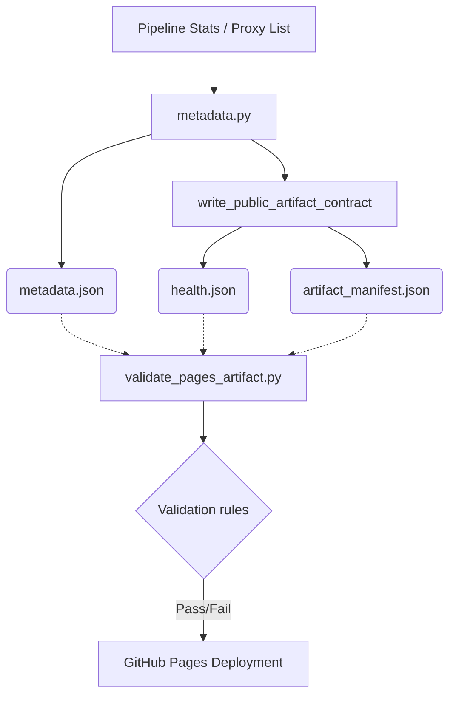

# Artifact Manifest & Health Endpoint Verification Audit

## Metadata & Health Endpoint Architecture Diagram

## Schema Key Drift & Field Alignment Verification Matrix

| Schema JSON Field | Python Generator (`metadata.py`) Field | Alignment Status | Notes |
| :--- | :--- | :--- | :--- |
| `exported_record_count` | `public_record_count` | ❌ Drift Detected | Schema defines `exported_record_count` while python code outputs `public_record_count` and `exported_total_proxies`. |
| `pipeline_wall_clock_seconds` | `duration` / `duration_seconds` | ❌ Drift Detected | Python code outputs `duration` and `duration_seconds`, missing `pipeline_wall_clock_seconds`. |
| `evasion_utls_enabled` | `evasion_utls_enabled` | ✅ Aligned | |
| `evasion_alpn_enabled` | `evasion_alpn_enabled` | ✅ Aligned | |
| `evasion_fragmentation_enabled` | `evasion_fragmentation_enabled` | ✅ Aligned | |
| `evasion_multiplexing_enabled` | `evasion_multiplexing_enabled` | ✅ Aligned | |
| `evasion_dns_safe_count` | `evasion_dns_safe_count` | ✅ Aligned | |
| `evasion_dns_hardened_count` | `evasion_dns_hardened_count` | ✅ Aligned | |
| `shielded_count` | `shielded_count` | ✅ Aligned | |
| `shielded_candidate_count` | `shielded_candidate_count` | ✅ Aligned | |
| `shielded_verified_count` | `shielded_verified_count` | ✅ Aligned | |
| `total_working` | `total_working` | ✅ Aligned | |
| `status` (health) | `"degraded"` if total_working == 0 else `"ok"` | ✅ Aligned | |

## PipelineStats Metric Export Completeness Audit

- **`exported_record_count`**: Missing in generator. `public_record_count` is being populated instead.
- **`pipeline_wall_clock_seconds`**: Missing in generator. `duration_seconds` is used instead.
- **`evasion_*` metrics**: Fully implemented and accounted for both in the schema and the generator payload (`evasion_utls_enabled`, `evasion_alpn_enabled`, `evasion_fragmentation_enabled`, `evasion_multiplexing_enabled`, `evasion_dns_safe_count`, `evasion_dns_hardened_count`).
- **`shielded_*` metrics**: Fully implemented (`shielded_count`, `shielded_candidate_count`, `shielded_verified_count`).

## Health Run Identity & Validation Rule Verification Table

| Validation Rule | Verification Target | Status |
| :--- | :--- | :--- |
| `run_id` | Read from `GITHUB_RUN_ID` environment variable | ✅ Verified |
| `run_attempt` | Read from `GITHUB_RUN_ATTEMPT` environment variable | ✅ Verified |
| `source_commit` | Read from `GITHUB_SHA` environment variable | ✅ Verified |
| `trace_id` | Populated from stats or defaults to `-` | ✅ Verified |
| `status` validation | Validated by schema enum (`"ok"`, `"degraded"`) | ✅ Verified |
| `artifact_manifest` validation | Size & hash matching checked exactly in `validate_pages_artifact.py` against file on disk | ✅ Verified |

## Zero-Working Proxy Fail-Open Generation

The pipeline is confirmed to support zero-working proxy fail-open generation. In `write_public_artifact_contract` (`src/configstream/output/metadata.py`), the health status is explicitly determined as:
`"status": "degraded" if int(metadata.get("total_working", 0) or 0) == 0 else "ok"`
This correctly implements a degraded state without prematurely crashing or failing the generation, allowing downstream consumers to safely fetch the metadata (which will contain zero working proxies but remain structurally valid).

## Hardening & Consistency Recommendations

1. **Align Schema and Python Output:** Update `metadata.py` to populate `exported_record_count` and `pipeline_wall_clock_seconds` to match `metadata.schema.json`, or update the schema to align with `public_record_count` and `duration_seconds`.
2. **Schema Property Requirements:** Consider strictly enforcing `exported_record_count` in the required array of `metadata.schema.json` once drift is resolved.
3. **Artifact Signature Enforcement:** Enhance signature enforcement for `artifact_manifest.json` to ensure deployment jobs fail without signing, rather than bypassing silently.
