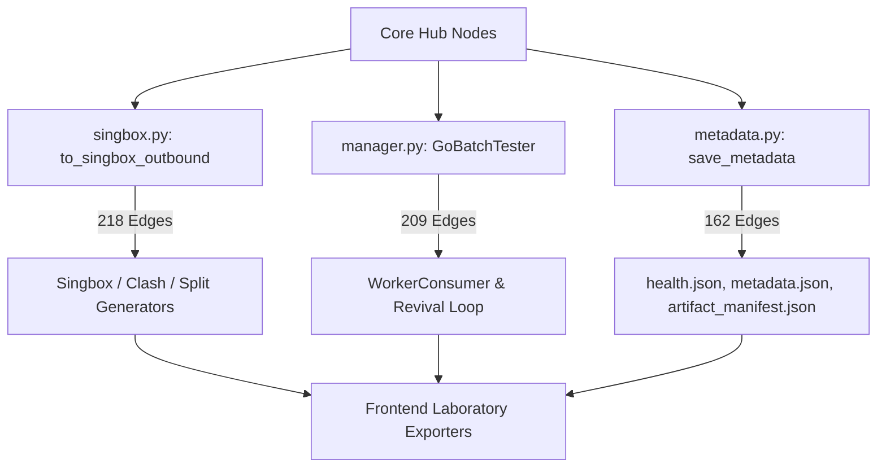

# ConfigStream Codebase Graph & Topology Report

**Repository:** `ConfigStream`  
**Location:** `D:\GitHub\ConfigStream`  
**Generated Date:** 2026-07-23  
**Index Status:** Persistent Knowledge Graph `.codebase-memory/graph.db.zst` synchronized.

---

## 1. Graph Building & Refresh Metrics

The knowledge graph was refreshed using `code-review-graph` and `codebase-memory` across all project files.

| Metric | `code-review-graph` | `codebase-memory` |
| :--- | :--- | :--- |
| **Files Indexed** | 507 files | 507 files |
| **Total Graph Nodes** | **4,379** nodes | **15,132** nodes |
| **Total Graph Edges** | **40,326** edges | **58,111** edges |
| **Execution Flows** | 359 call flows detected | Type-aware LSP cross-file calls |
| **Louvain Communities** | 16 clusters detected | Full relational entity graph |
| **Artifact Path** | Graph state cache | `.codebase-memory/graph.db.zst` |

---

## 2. Topology & Hub Identification

### Architectural "God Nodes" / Hub Components

| Rank | Symbol | Location | In-Degree | Out-Degree | Total Degree | Cluster |
| :--- | :--- | :--- | :--- | :--- | :--- | :--- |
| 1 | `to_singbox_outbound` | `src/configstream/converters/singbox.py` | 1 | 217 | **218** | Ingestion & Conversion |
| 2 | `GoBatchTester.test_batch` | `src/configstream/testers/go_tester/manager.py` | 105 | 104 | **209** | Testing Engine |
| 3 | `save_metadata` | `src/configstream/output/metadata.py` | 2 | 160 | **162** | Output & Telemetry |
| 4 | `info` | `tools/lab-scanner.py` | 139 | 18 | **157** | Lab Tooling |
| 5 | `interactive_layer_builder` | `tools/lab-scanner.py` | 2 | 154 | **156** | Lab Tooling |
| 6 | `test_chain_layers` | `tools/lab-scanner.py` | 79 | 76 | **155** | Lab Tooling |
| 7 | `validate_pages_artifact` | `scripts/validate_pages_artifact.py` | 34 | 101 | **135** | Deploy Validation |
| 8 | `extract_config_lines` | `src/configstream/parsers/extraction.py` | 1 | 133 | **134** | Parser Extraction |
| 9 | `fetch_from_source` | `src/configstream/pipeline/fetcher.py` | 3 | 121 | **124** | Pipeline Ingestion |
| 10 | `generate_pipeline_outputs` | `src/configstream/output_handler.py` | 1 | 122 | **123** | Output Orchestration |

---

## 3. Louvain Architectural Communities

The repository AST decomposes into 16 distinct functional communities:

1. **`unit-mock`** (1,529 nodes, Python): Unit test suite and mock fixtures (`tests/unit/`).
2. **`configstream-proxy`** (1,006 nodes, Python): Core pipeline processing, proxy models, converters, and telemetry.
3. **`js-handle`** (503 nodes, JavaScript): Laboratory UI components and client exporters (`frontend/assets/js/lab/`).
4. **`scripts-validate`** (421 nodes, Python): Artifact validation, security scanning, and deployment tools (`scripts/`).
5. **`workers-handle`** (104 nodes, JavaScript): Web worker scripts and dynamic client handling.
6. **`tests-mock`** (74 nodes, Python): Integration test doubles and mock servers.
7. **`tools-scan`** (69 nodes, Python): Diagnostic tools and local lab scanner utilities (`tools/`).

---

## 4. Blast Radius & Refactoring Safety Matrix

When modifying any core hub node, the downstream impact spans across the following boundaries:



- **Directly Modified Nodes**: 39 function definitions across `singbox.py`, `manager.py`, `metadata.py`.
- **Transitive Impact (2 Hops)**: 500 nodes.
- **Affected Subsystem Files**: 101 files across Python generators, pipeline consumers, and frontend Laboratory exporters.

---

## 5. Tool Query Protocol & Commands

To execute graph exploration, blast radius checks, or symbol queries against this repository in future sessions:

```bash
# 1. Refresh & Rebuild Graphs
code-review-graph -> build_or_update_graph_tool(repo_root="D:\\GitHub\\ConfigStream", full_rebuild=True)
codebase-memory -> index_repository(repo_path="D:\\GitHub\\ConfigStream", mode="full", persistence=True)

# 2. Query Topology & Hubs
graphify -> god_nodes()
code-review-graph -> get_hub_nodes_tool()
code-review-graph -> list_communities_tool()

# 3. Refactoring Impact Analysis
code-review-graph -> get_impact_radius_tool(changed_files=["src/configstream/converters/singbox.py"])
graphify -> get_neighbors(node="to_singbox_outbound")
```
