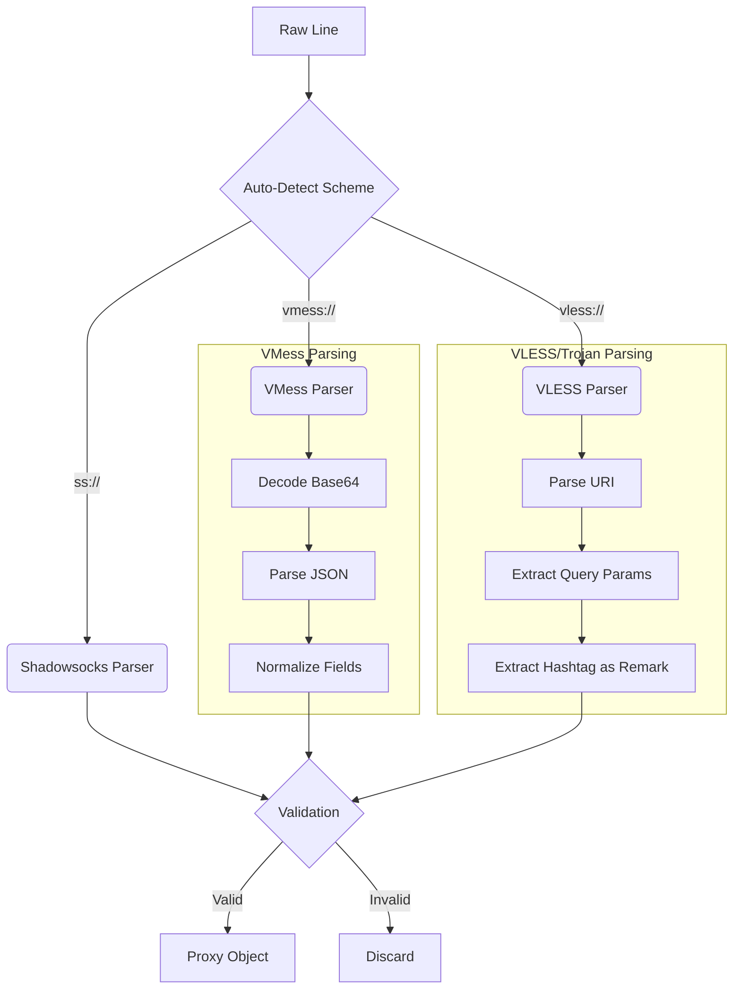

# 03. Protocols & Parsing

ConfigStream supports a vast array of censorship-circumvention protocols. This document details the parsing logic, validation rules, and client compatibility quirks for each.

## Protocol Support Matrix

| Protocol | Parsing Module | Supported Transports | Notes |
| :--- | :--- | :--- | :--- |
| **Shadowsocks** | `parsers.shadowsocks` | TCP, UDP, Obfs | The standard. Supports modern AEAD ciphers. |
| **VMess** | `parsers.vmess` | TCP, WS, gRPC, H2 | The V2Ray workhorse. Require UUID + AlterID(0). |
| **VLESS** | `parsers.vless` | TCP, WS, gRPC, Reality | Lightweight, unencrypted (TLS-native). |
| **Trojan** | `parsers.trojan` | TCP (TLS) | Mimics HTTPS traffic. |
| **Hysteria 2** | `parsers.others` | UDP | High-performance QUIC based. |
| **Tuic** | `parsers.others` | UDP | QUIC based. |
| **WireGuard** | `parsers.others` | UDP | Supported via Cloudflare WARP integration. |
| **SSH** | `parsers.others` | TCP | Legacy tunneling. |

## Parsing Logic Diagrams

### The Parsing Pipeline



## Detailed Protocol Analysis

### 1. Shadowsocks (SS)

**Schemes**: `ss://`
**Format Variants**:
1.  **Legacy**: `ss://BASE64(method:password@host:port)`
2.  **SIP002 (Preferred)**: `ss://BASE64(method:password)@host:port`
3.  **Plain**: `ss://method:password@host:port`

**Parsing Quirks**:
*   **Padding**: Base64 strings in `ss://` often lack correct padding (`=`). Our parser automatically appends padding before decoding.
*   **Plugins**: We handle SIP003 plugins (`v2ray-plugin`, `obfs-local`). However, complex arguments are often normalized to ensure cross-client compatibility.

### 2. VMess (V2Ray)

**Schemes**: `vmess://`
**Structure**: Almost exclusively a Base64-encoded JSON object.

**Critical Fields**:
*   `id` (UUID): The user ID. Must be a valid UUID.
*   `aid` (AlterID): **Must be 0**. Non-zero AlterID is deprecated and insecure. We force-set this to 0.
*   `net` (Network): Can be `tcp`, `ws`, `grpc`, `h2`.
*   `type` (Header): For TCP, can be `http` (obfuscation).
*   `scy` (Security): Usually `auto`.

**Transport Specifics**:
*   **WebSocket (WS)**: Requires `path` and `host` (for the Host header).
*   **gRPC**: Requires `serviceName`.
*   **H2**: Requires `path`.

### 3. VLESS (V2Ray / Xray)

**Schemes**: `vless://`
**Structure**: `vless://UUID@HOST:PORT?params#Remark`

**VLESS Reality (The Game Changer)**:
Reality replaces standard TLS with a "steal" mechanism.
*   **Required Fields**:
    *   `pbk` (Public Key): The public key of the Reality server.
    *   `sid` (Short ID): Hex string.
    *   `sni`: The domain being mimicked (e.g., `www.microsoft.com`).
    *   `fp`: Browser fingerprint (e.g., `chrome`).

**Validation Rule**: If `security=reality`, we check for `pbk` and `sid`. If missing, the proxy is invalid.

### 4. Trojan

**Schemes**: `trojan://`
**Structure**: `trojan://PASSWORD@HOST:PORT?params#Remark`

**Mechanism**:
Trojan listens on port 443. It performs a real TLS handshake. If the first packet after handshake doesn't contain the correct password hash, it proxies the traffic to a fallback web server (like Nginx). To a censor, it looks exactly like browsing a website.

### 5. Hysteria 2 & Tuic

**Schemes**: `hysteria2://`, `hy2://`, `tuic://`

**Characteristics**:
*   **UDP-based**: Uses QUIC.
*   **Congestion Control**: Designed to bully through packet loss.
*   **Obfuscation**: Uses a password to encrypt headers.

**Client Support**:
*   Sing-box: Native support.
*   Clash Meta: Native support.
*   Clash Premium: No support.
*   Surge: Partial support.

## Deduplication Logic

We define a "Unique Proxy" not by the full link string, but by its connectivity endpoint and credentials.

**Composite Key Construction**:
```python
def proxy_unique_key(p: Proxy) -> tuple:
    # Scheme + Host + Port + Username/UUID + Path
    return (
        p.protocol,
        p.address.lower(),
        p.port,
        p.username or p.uuid or "none",
        p.details.get("path", "")
    )
```

This prevents duplicate entries where the only difference is the "Remark" or the "SNI" (if SNI is not critical for identity).

## Validation Rules

Before a proxy enters the testing phase, it must pass the **Gatekeeper**:

1.  **Port Range**: 1-65535.
2.  **Host Validity**:
    *   Must not be a private IP (`192.168.x.x`, `10.x.x.x`, `127.0.0.1`) unless `allow_private` is set (dev mode).
    *   Must not be a broadcast or multicast address.
3.  **Field Integrity**:
    *   VMess: Must have `id` (UUID).
    *   Shadowsocks: Must have `method` and `password`.
    *   Trojan: Must have `password`.
4.  **Scheme Enforcement**: We reject "naked" links (IP:Port) unless they are in a specific raw format file.
