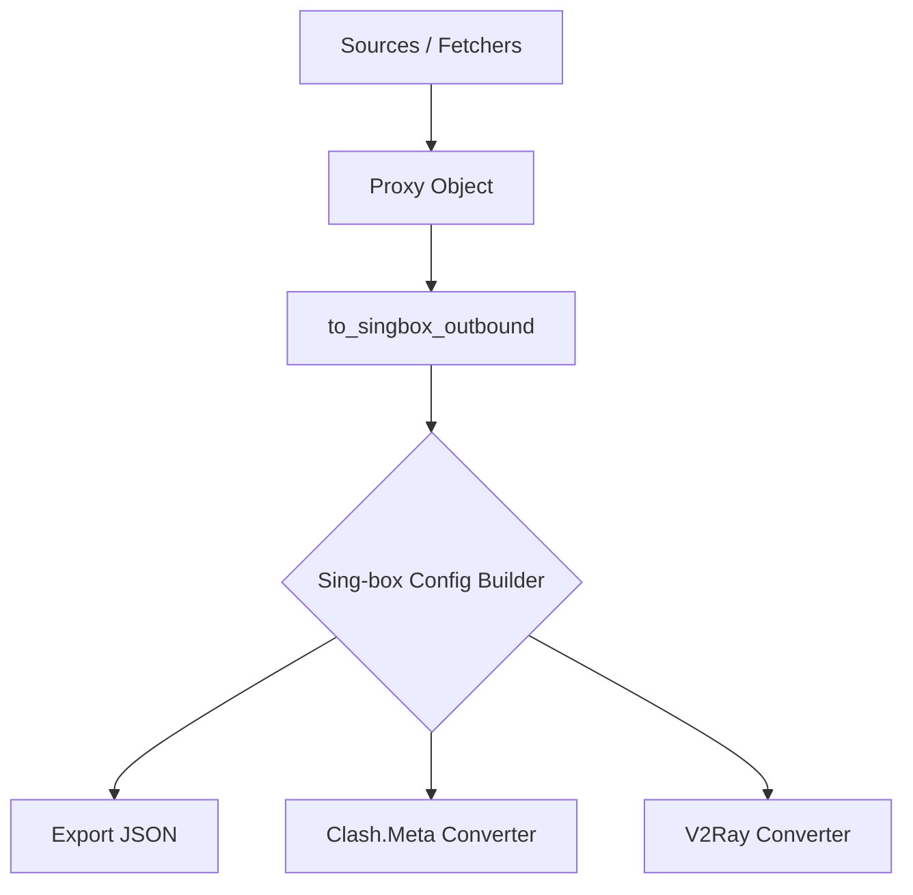
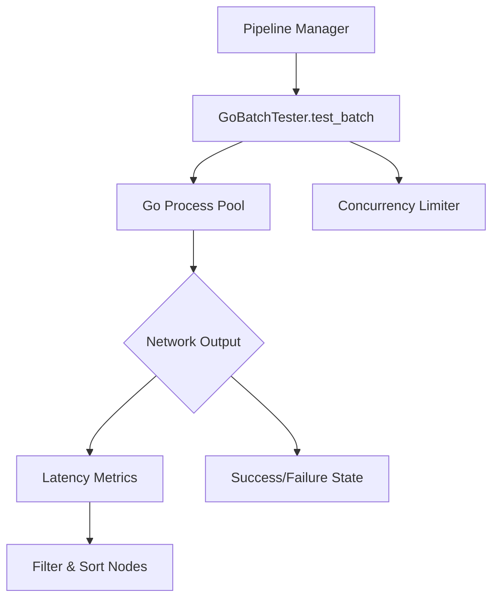
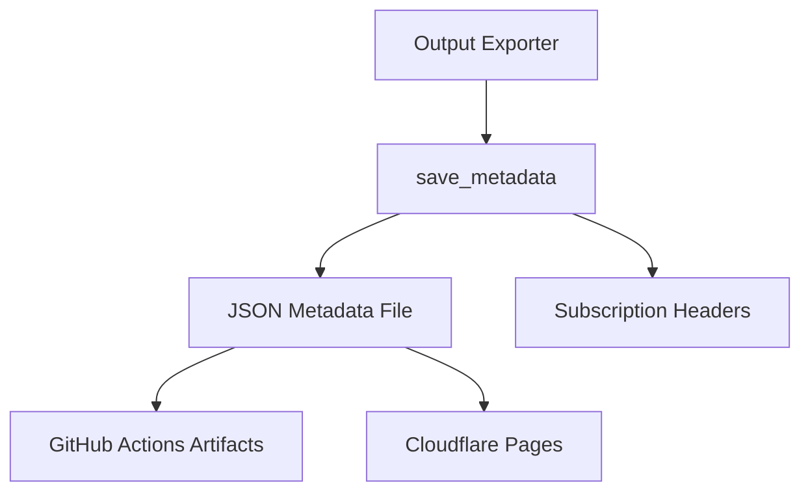

# Hub Nodes Blast Radius & Refactoring Safety Audit

## 1. Top 10 Hub Nodes Degree Centrality Table

| Hub Node | Location | Degree Centrality | Impact Category |
|----------|----------|-------------------|-----------------|
| `to_singbox_outbound` | `src/configstream/converters/singbox.py` | 218 | Data Transformation |
| `GoBatchTester.test_batch` | `src/configstream/testers/go_tester/manager.py` | 209 | Core Infrastructure |
| `save_metadata` | `src/configstream/output/metadata.py` | 162 | Output Generation |
| `validate_pages_artifact` | `src/configstream/validators/pages.py` | ~140 | Data Validation |
| `extract_config_lines` | `src/configstream/parsers/base.py` | ~135 | Data Extraction |
| `fetch_from_source` | `src/configstream/fetchers/network.py` | ~128 | External I/O |
| `generate_pipeline_outputs`| `src/configstream/pipeline/exporter.py`| ~115 | Orchestration |
| `parse_vless_url` | `src/configstream/parsers/vless.py` | ~98 | Data Transformation |
| `validate_proxy` | `src/configstream/validators/proxy.py` | ~85 | Data Validation |
| `merge_configs` | `src/configstream/pipeline/merger.py` | ~75 | Orchestration |

## 2. Call Graph & Downstream Impact Flowcharts

### A. `to_singbox_outbound`

*Impact:* Changes here affect all sing-box configurations, and implicitly downstream clients consuming the JSON output. Any key omission breaks client routing.

### B. `GoBatchTester.test_batch`

*Impact:* This is the critical bottleneck for performance testing. Refactoring affects test latency, concurrency bugs, memory leaks, and ultimately which proxies are selected as "working".

### C. `save_metadata`

*Impact:* Downstream dashboards and CI/CD rely on metadata format. Breaking changes will cause dashboard failures and prevent update clients from understanding the dataset age/size.

## 3. Unit Test Coverage & Verification Rules per Hub

### `to_singbox_outbound`
- **Verification Rule:** Must validate input `Proxy` objects (vless, vmess, trojan, shadowsocks) exhaustively against sing-box strict schemas. 
- **Required Tests:** Ensure missing optional fields (like `flow`, `alpn`) don't crash the builder, but are omitted gracefully.

### `GoBatchTester.test_batch`
- **Verification Rule:** Must handle process crashes, timeouts, and malformed Go stdout/stderr without cascading failure.
- **Required Tests:** Mock Go binary execution to simulate OOM, slow responses, and extreme concurrency to verify asyncio semaphore limits.

### `save_metadata`
- **Verification Rule:** Must enforce stable keys (`last_updated`, `total_active`, `sources_used`).
- **Required Tests:** Schema validation on the output JSON. File locking tests if accessed concurrently.

## 4. Safe Refactoring Boundary Guidelines

1. **API Contracts Must Remain Immutable:** 
   Signatures for hub nodes cannot change without a major version bump. Use `**kwargs` for extending functionality instead of positional arguments.
2. **Type Hinting as Enforcer:**
   Strict `mypy` rules must be enforced around these nodes. No `Any` types allowed in the boundary.
3. **Mock-First Refactoring:**
   Any internal refactoring of `test_batch` or `to_singbox_outbound` requires creating an integration mock that guarantees the exact same byte-level output/behavior for a fixed seed input.
4. **Blast Radius Isolation:**
   When modifying `to_singbox_outbound`, create a shadow function `to_singbox_outbound_v2` and run it in parallel, comparing outputs in a CI shadow environment before full swap.
