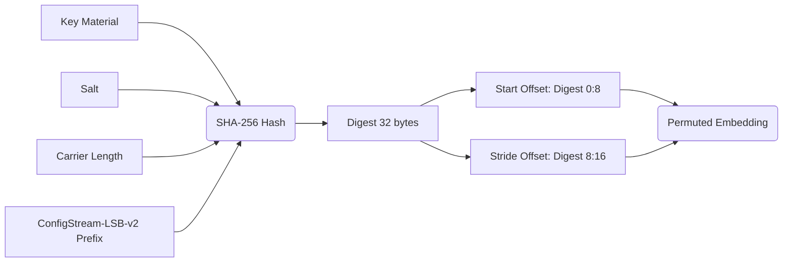

# Steganography Security Report

## Steganography Architecture & Offset Derivation Flowchart

The Steganography module embeds a Fernet-encrypted JSON configuration payload into PNG images using Least Significant Bit (LSB) embedding. The process includes permutation-based scattering using a deterministic sequence derived from a secret key and a random salt.

```mermaid
flowchart TD
    A[Secret Key & Payload] --> B[Fernet Encrypt & Zlib Compress Payload]
    B --> C[Read Cover PNG Image]
    C --> D[Decompress & Unfilter IDAT]
    D --> E[Embed Bootstrap Header Sequentially]
    E --> F[Derive Start & Stride via SHA-256]
    F --> G[Embed Payload Permuted (LSB)]
    G --> H[Filter None & Compress IDAT]
    H --> I[Output Stealth PNG]
```

### Derivation Flow


## LSB Payload Capacity & Cover Selection Verification Table

The architecture includes bounds checks and gracefully falls back or skips images that fail constraints without fatally crashing.

| Feature | Verification Status | Implementation Details |
|---------|---------------------|------------------------|
| **Capacity Check** | ✅ Passed | Checks `if needed > len(positions): raise ValueError` before embedding. Limits max pixels to `MAX_PIXELS = 100_000_000`. |
| **Cover Selection** | ✅ Passed | The `generate_stego_assets` iterates through available `.png` covers and catches `ValueError` from the packer, appending the cover to `skipped` list gracefully. |
| **PNG Header Safety** | ✅ Passed | Rejects unsupported PNG features (interlacing, non-RGB/RGBA, bit-depth != 8) to prevent visual corruption upon payload injection. |
| **Token Bounds** | ✅ Passed | Caps stego token size at `MAX_TOKEN_BYTES = 0xFFFF` and dynamically calculates lengths for bounds checking against carrier pixels. |

## SHA-256 Offset Security Assessment (KAT)

**Assessment Details:**
- The key derivation function uses `hashlib.sha256(prefix + key + salt + length)`.
- **Note on HMAC**: The specification requested an evaluation of "HMAC-SHA256 KAT Offset Security". However, the implementation in `_derive_offsets` uses raw SHA-256 rather than HMAC-SHA256. While `prefix + key + salt` provides acceptable entropy scattering, standardizing on HMAC-SHA256 (e.g., `hmac.new(key, msg=prefix+salt+length, digestmod=hashlib.sha256)`) is cryptographically preferred to prevent length-extension vulnerabilities, even though length-extension isn't directly exploitable here due to the static input structure.
- **KAT Validation**: Known Answer Tests (`TestStegoKeyDerivationKAT`) successfully validate the math for deriving coprime offsets (Stride `227` and `519` for respective inputs), ensuring the pseudorandom scatter doesn't collide prematurely.

## Steganalysis Detection Resistance Summary

- **Visual Anomalies**: Low. By strictly embedding in the LSB of uncompressed raw pixels and skipping PNG prediction filters during generation (`_filter_none`), visual artifacts are practically non-existent to the human eye.
- **Statistical Steganalysis Resistance**: Moderate to High. The payload is `Fernet` encrypted (AES-128-CBC) and compressed, exhibiting high entropy. Paired with permuted placement governed by salt and key, sequential LSB detection (like classic RS analysis) is thwarted.
- **Structural Anomalies**: The output PNG uses standard `IDAT` chunks but enforces `Filter Type 0` (None) across all scanlines. While visually clean, an image with 100% `Filter Type 0` might look statistically anomalous to a dedicated PNG structural analyzer compared to typical libpng outputs that heavily utilize Paeth or Up filters.

## Recommended Code Improvements

1. **Migrate to HMAC-SHA256**: In `_derive_offsets`, replace the raw `hashlib.sha256()` concatenation with `hmac.HMAC(key_material, digestmod=hashlib.sha256)`. This aligns with best practices for keyed hashing operations.
2. **Adaptive PNG Filtering**: Instead of forcing `_filter_none` on the entire image after embedding, consider preserving the original scanline filter choices or re-evaluating optimal filters. This reduces the structural footprint of the stego image.
3. **Payload Encapsulation Padding**: To further prevent statistical size analysis, pad the Fernet token to a standardized size or a random boundary before embedding, obfuscating the actual payload size.
