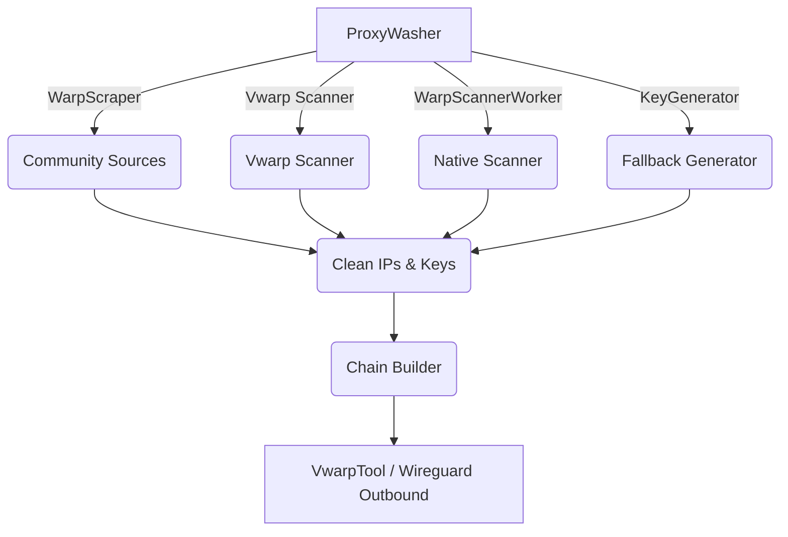

# WARP & Vwarp Key Management & Washer Security Audit

## Vwarp Tool & Washer Architecture Flowchart

## Key Validation & Key Pool Rotation Security Table

| Component | Status | Findings |
| --------- | ------ | -------- |
| `VwarpTool.validate_warp_key` | Needs Enhancement | Checks regex `^[a-zA-Z0-9+/=_-]{40,}$`. Effective basic validation, but does not decode Base64 explicitly to verify exact byte length (unlike `_normalize_wg_key` in `core.py`). |
| `warp_scraper.py` Fallbacks | Verified | Implements strict size limits (2MB), URL host allowlist (`raw.githubusercontent.com`), Base64 strict decoding with plain text fallback, and enforces entry limits. |
| `_classify_failure` | Missing | The `_classify_failure` function was not found in `VwarpTool`, `VwarpTunnel`, or `manager.py`. |
| Scanner Timeouts (60s) | Verified | Implemented in `scanner.py` (`safe_wait_for(proc.communicate(), timeout=60)`). The native `warp_scanner.py` enforces bounded deadlines. |
| Key Pool Rotation | Verified | Hash-based deterministic rotation uses `hashlib.sha256(relay_id.encode())` to rotate exit pools and IPs safely. |

## Preset Compliance Matrix

| Protocol | Implementation | Compliance Notes |
| -------- | -------------- | ---------------- |
| **MASQUE** | `light`, `medium`, `heavy`, `gfw` | Verified in `constants.py`. Contains standard obfuscation tuning fields (`Jc`, `MimicProtocol`, `FragmentInitial`, `SNIFragmentation`). |
| **AtomicNoize** | `light`, `medium`, `heavy` | Verified in `constants.py`. Incorporates WireGuard specific noise variables (`I1`, `I3`, `JcAfterI1`, `HandshakeDelay`). |
| **Psiphon** | `PSIPHON_COUNTRY_CODES` | Verified. Restricts regions to a known frozen set of country codes preventing arbitrary code injection or unsupported region errors. |

## WireGuard MTU & Outbound Configuration Verification

- **`warp.py` & `intelligence/washer/core.py`:** `mtu: 1280` is explicitly configured to prevent fragmentation over typical UDP paths.
- **`tools/vwarp/config.py`:** The `build_vwarp_config` function **fails** to set `"mtu": 1280` in the `wireguard` dictionary block, defaulting to standard MTU which could cause packet loss for nested tunnels.

## Recommended Hardening Patches

1. **Implement Missing Functionality:** Create `_classify_failure` in `VwarpTunnel` to distinguish between network timeouts, binary crashes, and SOCKS5 proxy failures.
2. **Patch MTU Config:** Inject `"mtu": 1280` explicitly into the `wireguard` dictionary in `src/configstream/tools/vwarp/config.py`.
3. **Enhance Key Validation:** Upgrade `VwarpTool.validate_warp_key` to decode the Base64 payload and assert a 32-byte length, preventing truncated or malformed keys from passing regex validation.
4. **Scraper Memory Profiling:** Enforce memory bounds during the `text_decode` scraping block where concatenated `.split()` operations might spike memory usage for malicious payloads up to 4MB.
