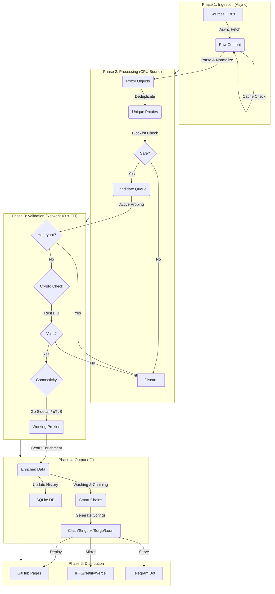
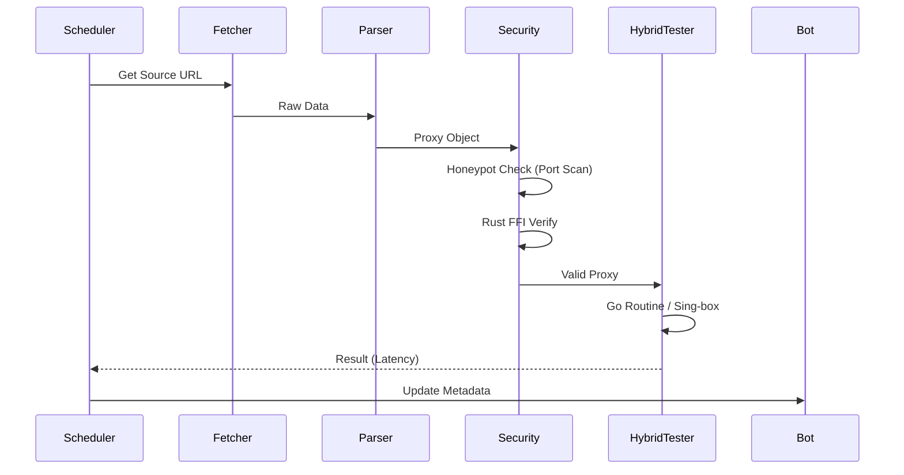

# 02. System Architecture

## The Pipeline

The core of ConfigStream is a linear but highly parallel pipeline designed to run efficiently on standard GitHub Actions runners (2-core, 7GB RAM). It follows a "Map-Reduce" pattern where sources are processed in parallel shards and then merged.

### 1. Ingestion (Fetcher)
We use `httpx` for asynchronous HTTP requests. The fetcher is the entry point of data.
-   **Concurrency**: Controlled via `asyncio.Semaphore` to prevent overwhelming the runner's network stack.
-   **Resilience**: Implements **Hedged Requests**. If a request takes longer than the 95th percentile expected time, we fire a second "hedge" request.
-   **Constraint**: Must respect GitHub Actions network limits (bandwidth/IO).

### 2. Parsing & Validation
Parsing is dangerous. Input is untrusted and often malformed.
-   **Strict Types**: We use `Pydantic` models to enforce schema validity.
-   **Auto-Detection**: The `auto_detect.py` module uses heuristics to identify protocols even if the scheme is missing.
-   **Protocol Expansion**: Support for Hysteria 2 (port hopping) and WireGuard (reserved bytes).

### 3. Testing (The Hybrid Engine)
We employ a hybrid testing engine, the "Resilient Core":
-   **Go Batch Tester**: A high-performance sidecar (`src/go/tester`) that handles massive concurrency (500+ checks) using Go routines, eliminating the Python GIL bottleneck. It handles raw socket connections and real protocol handshakes.
-   **Sing-box**: The primary connectivity tester for complex protocols (VLESS, VMess, Tuic) when deep packet inspection evasion is needed.
-   **Python Orchestrator**: Manages the pipeline logic, intelligence, and data flow.
-   **Rust FFI**: For high-performance Shadowsocks crypto validation (`src/rust/ss_checker`).
-   **Honeypot Probe**: Actively scans the proxy IP for suspicious ports (22, 23, 3389) to detect interception nodes.

### 4. Intelligence Layer (Proxy Washing)
ConfigStream includes a unique "Washing" layer:
-   **Dirty IP Washing**: Proxies with flagged IPs are wrapped in Cloudflare WARP tunnels.
-   **Smart Chains**: Logic to bridge domestic relays (e.g., IR) to foreign exits, or IPv4 relays to IPv6 exits.
-   **Deterministic Keying**: Ensures the same relay always gets the same exit identity to prevent connection flapping.

### 5. Output & Distribution
We generate multiple formats:
-   **Universal**: Base64 subscription.
-   **Clients**: Clash, Sing-box (Tank & Sniper modes), Surge, Loon, Quantumult X, SIP008.
-   **Metadata**: `metadata.json` for the frontend and bot.

### 6. The Bot Architecture
The ConfigStream Bot operates in two modes:
1.  **Stateless (Cloudflare Worker)**: Fetches `metadata.json` and `proxies.json` from the GitHub Pages CDN and serves them to users. No database required.
2.  **Polling (CLI)**: Runs as a standard Python process (`configstream bot`) for local or server-based deployments.

## AsyncIO Design

Python's `asyncio` is single-threaded, but ideal for IO-bound tasks.
-   **Event Loop**: The default loop is usually sufficient, but `uvloop` can be used for speedup.
-   **Batching**: We process proxies in chunks to avoid OOM errors.

