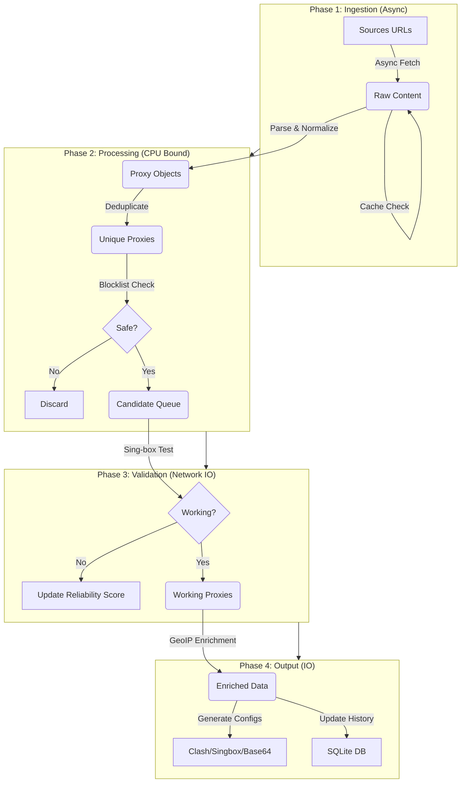
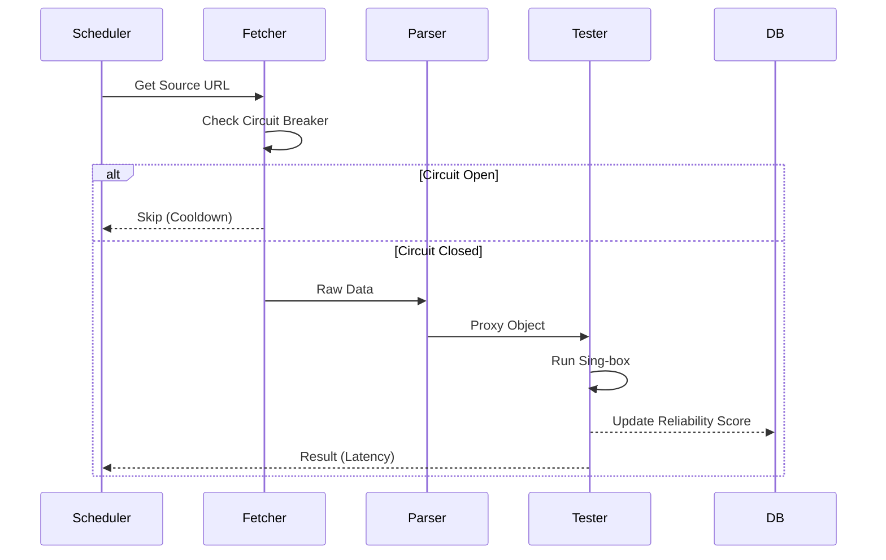

# 02. System Architecture

## The Pipeline

The core of ConfigStream is a linear but highly parallel pipeline designed to run efficiently on standard GitHub Actions runners (2-core, 7GB RAM). It follows a "Map-Reduce" pattern where sources are processed in parallel shards and then merged.

### 1. Ingestion (Fetcher)
We use `httpx` for asynchronous HTTP requests. The fetcher is the entry point of data.
-   **Concurrency**: Controlled via `asyncio.Semaphore` to prevent overwhelming the runner's network stack or getting banned by source servers.
-   **Resilience**: Implements **Hedged Requests**. If a request takes longer than the 95th percentile expected time, we fire a second "hedge" request. The first to return wins. This smooths out tail latency.
-   **Constraint**: Must respect GitHub Actions network limits (bandwidth/IO). We avoid downloading huge files if headers indicate excessive size.

### 2. Parsing & Validation
Parsing is dangerous. Input is untrusted and often malformed.
-   **Strict Types**: We use Python's `typing` and `Pydantic` models to enforce schema validity.
-   **Regex vs. URL Parsing**: We prefer `urllib.parse` for standard schemes (e.g., `http://`) but fallback to robust Regex for base64 blobs or non-standard URIs (e.g., `vmess://`).
-   **Auto-Detection**: The `auto_detect.py` module uses heuristics to identify protocols even if the scheme is missing or incorrect, scanning for known signatures (e.g., specific JSON keys for VMess).

### 3. Testing (The Engine)
We use `sing-box` as the underlying test engine because it supports almost every modern protocol (VLESS, Hysteria2, Tuic, WireGuard) and is extremely performant (Go-based).
-   **Wrapper**: `src/configstream/testers.py` wraps the binary execution.
-   **Performance**: We generate a temporary, minimal config file for `sing-box`, run it in "url-test" mode against a low-latency target (e.g., `http://cp.cloudflare.com/generate_204`), and parse the JSON output.
-   **Isolation**: Each test runs in isolation (or batched) to ensure one bad proxy doesn't crash the tester.

### 4. Output & Distribution
We generate multiple formats to support different clients:
-   **Clash**: YAML format using a Jinja2-like template or direct PyYAML dump.
-   **Sing-box**: JSON format matching the strict schema of Sing-box.
-   **Base64**: Standard subscription link (one config per line, base64 encoded).
-   **Metadata**: A rich JSON file (`metadata.json`) containing analytics for the frontend.

## AsyncIO Design

Python's `asyncio` is single-threaded, but ideal for IO-bound tasks like fetching and testing.
-   **Event Loop**: The default loop is usually sufficient, but `uvloop` can be used for 2x speedup in heavy loads.
-   **Batching**: We process proxies in chunks (e.g., 50 at a time) to avoid OOM (Out of Memory) errors and manage open file descriptors.

