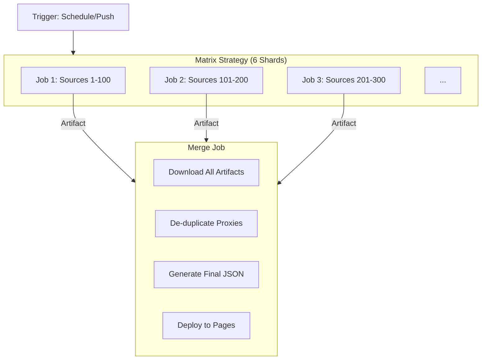

# 05. DevOps & CI/CD

## The GitHub Actions Matrix Strategy

We have 600+ sources. Fetching and testing them all sequentially would take hours. GitHub Actions provides 20 concurrent jobs for free users. We maximize this.

### Configuration (`.github/workflows/pipeline.yml`)
We use a `matrix` strategy to shard the `sources/` directory.
-   **Input**: `sources/batch_1.txt` to `sources/batch_6.txt`.
-   **Parallelism**: 6 jobs run simultaneously.
-   **Data Passing**: Each job saves its results (`output_batch_X/`) as a GitHub Artifact. The final job downloads all matching artifacts.

## Smart Mirroring (Anti-Censorship)

To ensure accessibility even if GitHub is blocked, we deploy to multiple decentralized providers via `.github/workflows/deploy_mirror.yml`.

### Targets
1.  **IPFS (InterPlanetary File System)**:
    -   We use `ipfs-car` or Pinata actions to pin the `output/` directory.
    -   This creates a permanent, content-addressed hash (CID) accessible via any IPFS gateway.
2.  **Vercel & Netlify**:
    -   We push the static artifacts to these CDNs using their respective Actions.
    -   This provides alternative domains (`configstream.vercel.app`, etc.).

## The Bot Deployment

The Telegram Bot is deployed separately to keep the main pipeline focused on data.

### Stateless Cloudflare Worker
-   **Code**: `tools/bot/worker.js`.
-   **Deployment**: Manually deployed (or via Wrangler action) to Cloudflare Workers.
-   **Logic**: It fetches the `metadata.json` generated by the pipeline from GitHub Pages. This "Zero DB" approach means the bot costs $0 to run and scales infinitely.

## Caching Intelligence

We use `actions/cache` to persist intelligence between runs.

**Cached Paths:**
-   `data/source_quality.db`: Reliability scores.
-   `data/adaptive_timeout.db`: Latency stats.
-   `data/GeoLite2.mmdb`: GeoIP database.

**Cache Key Strategy:**
-   `restore-keys` allows fetching cache from the *previous* run even if the commit hash changed.

## Security Scanning

We run `gitleaks` and `bandit` in the CI pipeline to ensure:
1.  No API keys or secrets are accidentally committed.
2.  No unsafe Python code is introduced.
