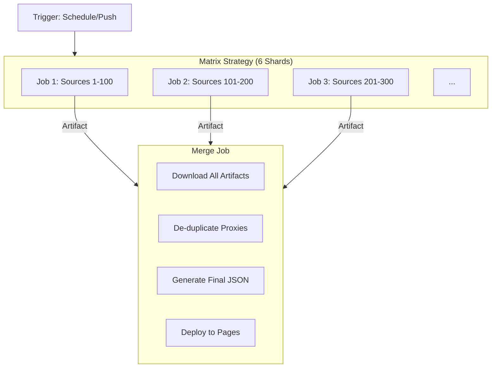

# 05. DevOps & CI/CD

## The GitHub Actions Matrix Strategy

We have 600+ sources. Fetching and testing them all sequentially would take hours. GitHub Actions provides 20 concurrent jobs for free users. We maximize this.

### Configuration (`.github/workflows/pipeline.yml`)
We use a `matrix` strategy to shard the `sources/` directory.
-   **Input**: `sources/batch_1.txt` to `sources/batch_6.txt`.
-   **Parallelism**: 6 jobs run simultaneously.
-   **Data Passing**: Each job saves its results (`output_batch_X/`) as a GitHub Artifact. The final job downloads all matching artifacts pattern `shard-run-*`.

## Caching Intelligence

We use `actions/cache` to persist intelligence between runs.

**Cached Paths:**
-   `data/source_quality.db`: The brain. Tracks reliability scores.
-   `data/adaptive_timeout.db`: The nervous system. Tracks latency stats.
-   `data/GeoLite2.mmdb`: The map. ~60MB file, cached to save bandwidth.

**Cache Key Strategy:**
-   We use `restore-keys` to allow partial matches (e.g., fetching the cache from the *previous* run even if the commit hash changed).

## IPFS (InterPlanetary File System)

To make our subscription links censorship-resistant, we aim to publish to IPFS.

**Current Status**: The IPFS publication step in our pipeline is currently a **placeholder/simulation**.
We have designed the architecture to use `ipfs-car` to pack the `output/` directory into a Content Addressable Archive (CAR) file.

**Implementation Plan**:
1.  **Tool**: `npm install -g ipfs-car`.
2.  **Action**: In the `merge_results` job, run `ipfs-car --pack output --output output.car`.
3.  **Upload**: Use a pinning service API (like Web3.storage or Pinata) to upload the `.car` file. This requires secrets (`IPFS_TOKEN`) which are not yet provisioned in the public repo.

Once fully enabled, this will provide a hash (CID) like `bafy...` that serves the content forever, decentralized.

## Security Scanning

We run `gitleaks` and `bandit` in the CI pipeline to ensure:
1.  No API keys or secrets are accidentally committed.
2.  No unsafe Python code (e.g., `eval()`, `pickle`) is introduced.
