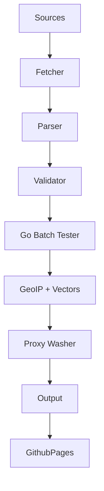

# Architecture

ConfigStream uses a **Linear Streaming Pipeline** architecture designed for high throughput within the memory constraints of a GitHub Actions runner (7GB RAM).

## The Hybrid Engine

### 1. Python Orchestrator (`src/configstream/`)
*   **Role:** Logic, Parsing, Intelligence, Output.
*   **Why Python?** Rich ecosystem for text processing (Regex), async I/O (`httpx`), and data handling (`pydantic`).

### 2. Go Sidecar (`src/go/tester/`)
*   **Role:** Raw Socket Testing.
*   **Why Go?** Python's `asyncio` overhead is too high for opening 500+ concurrent TCP sockets rapidly. Go's goroutines handle this effortlessly.
*   **Communication:** Python pipes JSON batches to the Go binary's `stdin` and reads JSON results from `stdout`.

### 3. WASM Edge (`frontend/assets/wasm/`)
*   **Role:** Distributed Verification.
*   **Why WASM?** To scale beyond the CI runner's limits. We compile the Go tester to WebAssembly, allowing every user visiting the site to verify proxies from *their* network perspective.

## Pipeline Stages

1.  **Fetch:** Async HTTP/2 with ETag caching.
2.  **Parse:** Regex-based detection for 25+ protocols (VMess, VLESS, Trojan, etc.).
3.  **Validate:** Passive security checks (Blocklist, VirusTotal).
4.  **Test:** High-concurrency connectivity check (Latency + Jitter).
5.  **Enrich:** GeoIP resolution (Offline MMDB).
6.  **Analyze:** Vector generation and Pareto scoring.
7.  **Wash:** Wrap specific proxies in WARP.
8.  **Output:** Atomic generation of JSON/YAML artifacts.

## Data Flow

## Static Vector Search
Instead of a vector database (Pinecone/Milvus), we generate lightweight feature vectors (Protocol, Country, Latency, Port Hash) during the pipeline. These are saved to `vectors.json`. The frontend computes cosine similarity in JavaScript to find "Proxies like this one".
