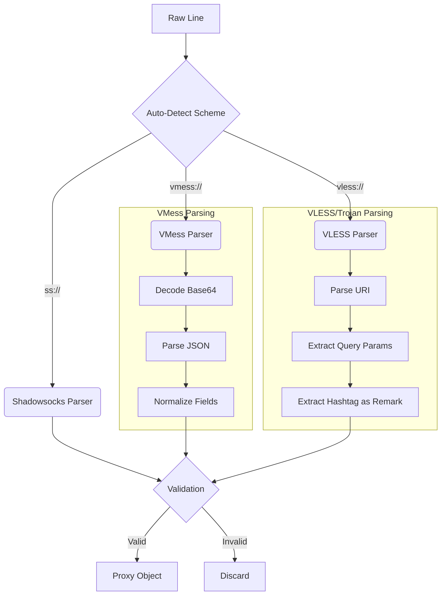

# 03. Protocols & Parsing

ConfigStream supports a vast array of censorship-circumvention protocols. This document details the parsing logic, validation rules, and client compatibility quirks for each.

> **Deep dives**: Each major protocol has a dedicated encyclopedia page with URI format examples, Sing-box config snippets, intelligence scores, and client compatibility tables. Links are provided in each section below.

## Protocol Support Matrix

ConfigStream supports **26+ protocols** with comprehensive parsing and validation.

| Protocol | Parsing Module | Supported Transports | Notes |
| :--- | :--- | :--- | :--- |
| **Shadowsocks** | `parsers.shadowsocks` | TCP, UDP, Obfs | The standard. Supports modern AEAD ciphers. |
| **SS2022** | `parsers.shadowsocks` | TCP, UDP | Modern Shadowsocks with improved security. |
| **VMess** | `parsers.vmess` | TCP, WS, gRPC, H2 | The V2Ray workhorse. Require UUID + AlterID(0). |
| **VLESS** | `parsers.vless` | TCP, WS, gRPC, Reality | Lightweight, unencrypted (TLS-native). |
| **Trojan** | `parsers.trojan` | TCP (TLS) | Mimics HTTPS traffic. |
| **Hysteria 2** | `parsers.hysteria` | UDP | High-performance QUIC based. |
| **Tuic** | `parsers.tuic` | UDP | QUIC based. |
| **WireGuard** | `parsers.wireguard` | UDP | Native support + Cloudflare WARP integration. |
| **OpenVPN** | `parsers.openvpn` | TCP, UDP | Industry standard VPN protocol. |
| **ShadowsocksR** | `parsers.ssr` | TCP | Legacy SS fork with obfuscation. |
| **SSH** | `parsers.others` | TCP | Legacy tunneling. |
| **SOCKS5/HTTP** | `parsers.generic` | TCP | Standard proxy protocols. |
| **Juicity** | `parsers.others` | UDP | QUIC-based protocol. |

## Parsing Logic Diagrams

### The Parsing Pipeline



## Detailed Protocol Analysis

### 1. Shadowsocks (SS)

> **Encyclopedia**: [Shadowsocks Deep Dive](../encyclopedia/protocols/shadowsocks.md) — AEAD vs SS2022, cipher matrix, client compatibility.

**Schemes**: `ss://`
**Format Variants**:
1.  **Legacy**: `ss://BASE64(method:password@host:port)`
2.  **SIP002 (Preferred)**: `ss://BASE64(method:password)@host:port`
3.  **Plain**: `ss://method:password@host:port`

**Parsing Quirks**:
*   **Padding**: Base64 strings in `ss://` often lack correct padding (`=`). Our parser automatically appends padding before decoding.
*   **Plugins**: We handle SIP003 plugins (`v2ray-plugin`, `obfs-local`). However, complex arguments are often normalized to ensure cross-client compatibility.

### 2. VMess (V2Ray)

> **Encyclopedia**: [VMess Deep Dive](../encyclopedia/protocols/vmess.md) — Base64 JSON structure, AlterID history, VMess vs VLESS comparison.

**Schemes**: `vmess://`
**Structure**: Almost exclusively a Base64-encoded JSON object.

**Critical Fields**:
*   `id` (UUID): The user ID. Must be a valid UUID.
*   `aid` (AlterID): **Must be 0**. Non-zero AlterID is deprecated and insecure. We force-set this to 0.
*   `net` (Network): Can be `tcp`, `ws`, `grpc`, `h2`.
*   `type` (Header): For TCP, can be `http` (obfuscation).
*   `scy` (Security): Usually `auto`.

**Transport Specifics**:
*   **WebSocket (WS)**: Requires `path` and `host` (for the Host header).
*   **gRPC**: Requires `serviceName`.
*   **H2**: Requires `path`.

### 3. VLESS (V2Ray / Xray)

> **Encyclopedia**: [VLESS Deep Dive](../encyclopedia/protocols/vless.md) — Reality mechanism, transport options, intelligence scores.

**Schemes**: `vless://`
**Structure**: `vless://UUID@HOST:PORT?params#Remark`

**VLESS Reality (The Game Changer)**:
Reality replaces standard TLS with a "steal" mechanism.
*   **Required Fields**:
    *   `pbk` (Public Key): The public key of the Reality server.
    *   `sid` (Short ID): Hex string.
    *   `sni`: The domain being mimicked (e.g., `www.microsoft.com`).
    *   `fp`: Browser fingerprint (e.g., `chrome`).

**Validation Rule**: If `security=reality`, we check for `pbk` and `sid`. If missing, the proxy is invalid.

**Transport Variations**:
*   **GRPC**: Fully supported.
*   **H2**: Supported.
*   **Split-HTTP**: Experimental support.

### 4. Trojan

> **Encyclopedia**: [Trojan Deep Dive](../encyclopedia/protocols/trojan.md) — HTTPS mimicry, fallback mechanism, detection resistance.

**Schemes**: `trojan://`
**Structure**: `trojan://PASSWORD@HOST:PORT?params#Remark`

**Mechanism**:
Trojan listens on port 443. It performs a real TLS handshake. If the first packet after handshake doesn't contain the correct password hash, it proxies the traffic to a fallback web server (like Nginx). To a censor, it looks exactly like browsing a website.

### 5. Hysteria 2 & Tuic

> **Encyclopedia**: [Hysteria2 Deep Dive](../encyclopedia/protocols/hysteria2.md) — Brutal congestion control, Salamander obfuscation, port hopping, UDP blocking vulnerability.

**Schemes**: `hysteria2://`, `hy2://`, `tuic://`

**Characteristics**:
*   **UDP-based**: Uses [QUIC](../encyclopedia/glossary/networking_terms.md) — a modern transport protocol built on UDP that encrypts the entire transport layer.
*   **Congestion Control**: Hysteria2 uses "Brutal" — instead of backing off when packet loss is detected (like TCP does), it maintains a target bandwidth regardless. Think of it as a car that doesn't slow down in rain.
*   **Obfuscation**: Salamander obfuscation adds a layer over QUIC to disguise the protocol signature.

**Client Support**:
*   Sing-box: Native support.
*   Clash Meta: Native support.
*   Clash Premium: No support.
*   Surge: Partial support.

## Deduplication Logic

We define a "Unique Proxy" not by the full link string, but by its connectivity endpoint and credentials.

**Composite Key Construction**:
```python
def proxy_unique_key(p: Proxy) -> tuple:
    # Scheme + Host + Port + Username/UUID + Path
    return (
        p.protocol,
        p.address.lower(),
        p.port,
        p.username or p.uuid or "none",
        p.details.get("path", "")
    )
```

This prevents duplicate entries where the only difference is the "Remark" or the "SNI" (if SNI is not critical for identity).

## Validation Rules

Before a proxy enters the testing phase, it must pass the **Gatekeeper**:

1.  **Port Range**: 1-65535 (strict validation).
2.  **Host Validity**:
    *   Must not be a private IP (`192.168.x.x`, `10.x.x.x`, `127.0.0.1`) unless `allow_private` is set (dev mode).
    *   Must not be a broadcast or multicast address.
    *   Hostname format validation (RFC-compliant, max 253 chars).
3.  **Field Integrity**:
    *   VMess: Must have `id` (UUID).
    *   Shadowsocks: Must have `method` and `password`.
    *   Trojan: Must have `password`.
    *   SSR: Must call `normalize_proxy_details()` for consistency.
4.  **Security Constraints** (v2.0.12):
    *   **OpenVPN**: Max config size 1MB (DoS prevention), strict "client" directive matching (not in comments).
    *   **Generic Parser**: IPv4/IPv6/hostname validation with regex patterns to prevent injection.
    *   **All Parsers**: Input sanitization, blocklisting, and size limits applied.
5.  **Scheme Enforcement**:
    *   Standard parsing requires valid schemes (`vmess://`, `ss://`).
    *   **Naked IP Support**: We have limited support for `IP:PORT` lines with strict validation. These are heuristically detected (e.g. port 80/443 -> HTTP, 1080 -> SOCKS) and parsed as generic proxies. This is disabled for strict sources to prevent false positives.
    *   **Port Hopping**: Hysteria2 port hopping syntax (`ports=1000-2000`) is parsed, but complex hopping rules may be simplified for client compatibility.

## Related Documentation

*   **[Networking Terms](../encyclopedia/glossary/networking_terms.md)** — TLS, SNI, DPI, QUIC, WebSocket, gRPC, ALPN explained.
*   **[Security Concepts](../encyclopedia/glossary/security_concepts.md)** — AEAD, replay protection, entropy analysis, active probing.
*   **[Firewalls & Honeypots](../encyclopedia/security/firewall_honeypot.md)** — How GFW, Iran, and Russia detect and block these protocols.
*   **[Sing-box Configuration Guide](../encyclopedia/tools/singbox_configuration_guide.md)** — How parsed proxies become Sing-box outbound configs.
*   **[WireGuard & WARP](../encyclopedia/networking/warp.md)** — WireGuard parsing and WARP integration for washing/shielding.
