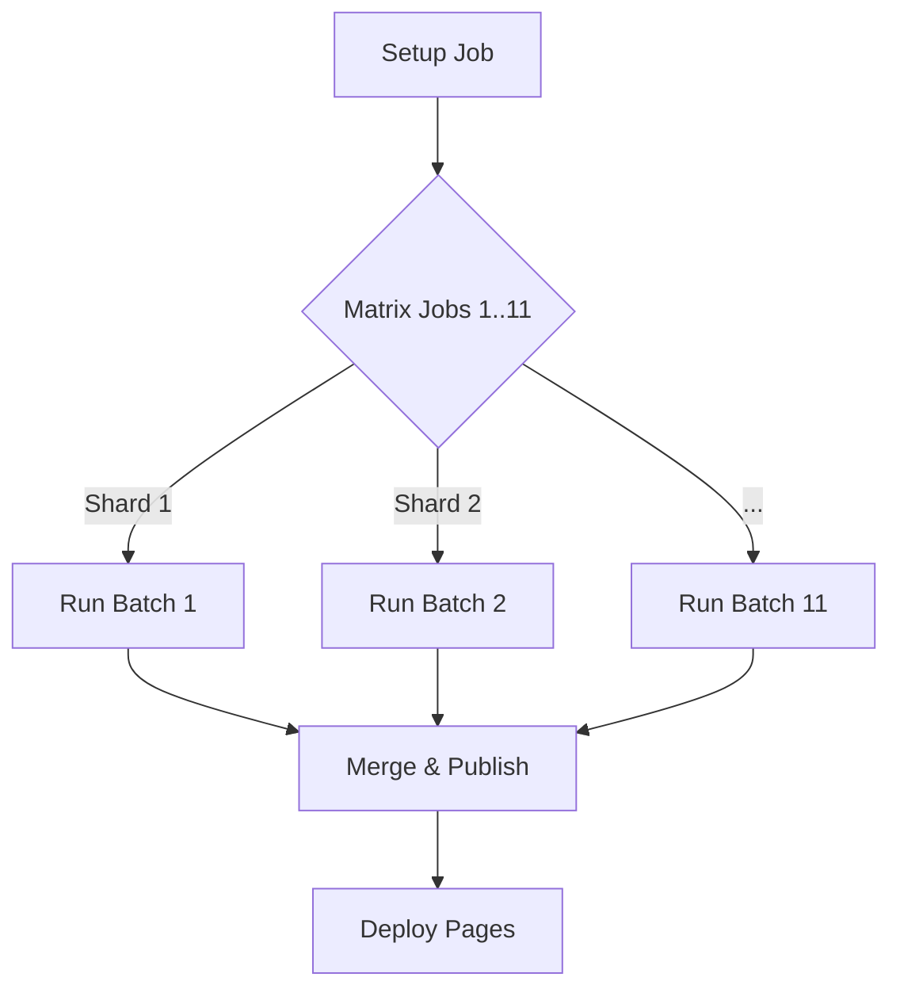

# 05. DevOps & Infrastructure

ConfigStream relies on a robust, automated DevOps pipeline. We adhere to "GitOps" principles: everything is code, and the repository state is the source of truth.

## 1. The GitHub Actions Pipeline

The heart of the system is `.github/workflows/pipeline.yml`.

### Workflow Triggers
*   **Schedule**: `cron: "0 */3 * * *"` (Every 3 hours).
*   **Manual**: `workflow_dispatch` (For emergency updates).
*   **Push**: On changes to `main` (For testing code changes).

### Job Architecture

The pipeline uses a **Matrix Strategy** to parallelize work.



#### 1. Setup (`setup`)
*   Installs dependencies (`pip`, `go`, `cargo`).
*   Restores caches:
    *   `pip-cache`
    *   `go-build-cache`
    *   `intelligence-db-cache` (`data/*.db`)
*   Pre-warms DNS cache.

#### 2. Sharding (`aggregator`)
*   We split `sources/` into 11 batch files (`sources/batch_1.txt` to `batch_11.txt`).
*   Each job in the matrix picks one batch file and processes it independently.
*   **Result**: Each job outputs a `partial_output_{id}.zip`.

#### 3. Merge (`merge_results`)
*   Downloads all partial artifacts.
*   Merges:
    *   Proxy lists (Deduplication).
    *   SQLite Databases (`anomaly.db`, `source_quality.db`) using `merge_from` logic.
*   Generates final `metadata.json` and `summary.json`.
*   Commits updated databases back to a persistent cache branch or artifact storage.

## 2. Caching Strategy

We heavily utilize `actions/cache` to persist state between ephemeral runners.

| Cache Key | Contents | Purpose |
| :--- | :--- | :--- |
| `db-sqlite-{hash}` | `data/*.db` | Persist Anomaly/Quality history. |
| `mmdb-geoip` | `data/*.mmdb` | Avoid redownloading GeoIP DBs. |
| `warp-keys` | `data/warp_keys.json` | Keep valid WARP identities. |

## 3. Security in CI/CD

*   **Secret Scanning**: We use `gitleaks` in pre-commit hooks to prevent committing API keys.
*   **Dependency Pinning**: All dependencies in `pyproject.toml` are pinned or version-ranged to prevent supply chain attacks.
*   **Minimum Permissions**: The `GITHUB_TOKEN` has read-only access except for the specific `deploy` job which needs write access to `gh-pages`.

## 4. Deployment & CDNs

### GitHub Pages
*   **Branch**: `gh-pages` (Orphan branch).
*   **Content**: The `output/` directory + `frontend/` assets.
*   **CDN**: Served via Fastly (GitHub's partner).

### Mirrors (Redundancy)
If GitHub is blocked, we automatically mirror to:
1.  **Cloudflare Pages**: Via a separate workflow trigger or pull-model.
2.  **IPFS**: We pin the output folder to IPFS using a pinning service (like Pinata) if configured.
3.  **Hugging Face**: We push datasets to Hugging Face Hub for ML usage.

## 5. Local Development

We provide a `docker-compose.yml` for replicating the CI environment.

```bash
# Start the pipeline locally
docker compose up --build

# Run the web server
docker compose up web
```

### Environment Variables
*   `MAX_WORKERS`: Control concurrency (Default: Auto).
*   `WARP_KEY_POOL`: JSON list of keys for the Washer.
*   `TELEGRAM_BOT_TOKEN`: For the bot interface.
