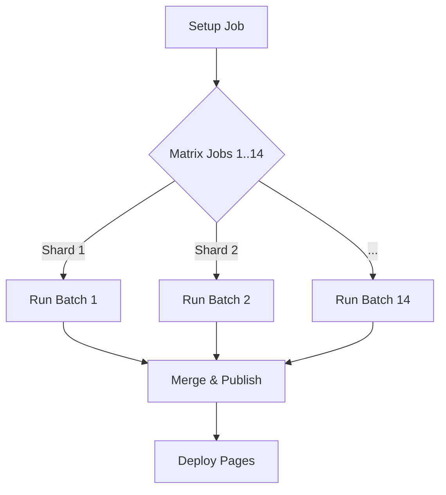

# 05. DevOps & Infrastructure

ConfigStream relies on a robust, automated DevOps pipeline. We adhere to "GitOps" principles: everything is code, and the repository state is the source of truth.

## 1. The GitHub Actions Pipeline

The heart of the system is `.github/workflows/main.yml`.

### Workflow Triggers
*   **Schedule**: `cron: "0 */4 * * *"` (Every 4 hours).
*   **Manual**: `workflow_dispatch` (For emergency updates).
*   **Push**: On changes to `main` (For testing code changes).

### Job Architecture

The pipeline uses a **Matrix Strategy** to parallelize work.



#### 1. Setup (`setup`)
*   Installs dependencies (`pip`, `go`, `cargo`).
*   Restores caches:
    *   `pip-cache`
    *   `go-build-cache`
    *   `intelligence-db-cache` (`data/*.db`)
*   Pre-warms DNS cache.

#### 2. Sharding (`aggregator`)
*   We split `sources/` into 14 batch files (`sources/batch_1.txt` to `batch_14.txt`).
*   Each job in the matrix picks one batch file and processes it independently.
*   **Result**: Each job outputs a `partial_output_{id}.zip`.

#### 3. Merge (`merge_results`)
*   Downloads all partial artifacts.
*   Merges:
    *   Proxy lists (Deduplication).
    *   SQLite Databases (`anomaly.db`, `source_quality.db`) using `merge_from` logic.
*   Generates final `metadata.json`.
*   Commits updated databases back to a persistent cache branch or artifact storage.

## 2. Caching Strategy

We heavily utilize `actions/cache` to persist state between ephemeral runners.

| Cache Key | Contents | Purpose |
| :--- | :--- | :--- |
| `db-sqlite-{hash}` | `data/*.db` | Persist Anomaly/Quality history. |
| `mmdb-geoip` | `data/*.mmdb` | Avoid redownloading GeoIP DBs. |
| `warp-keys` | `data/warp_keys.json` | Keep valid WARP identities. |

## 3. Security in CI/CD

*   **Secret Scanning**: We use `gitleaks` in pre-commit hooks to prevent committing API keys.
*   **Dependency Pinning**: All dependencies in `pyproject.toml` are pinned or version-ranged to prevent supply chain attacks.
*   **Minimum Permissions**: The `GITHUB_TOKEN` has read-only access except for the `deploy` job which needs write access to upload the Pages artifact.

## 4. Deployment & CDNs

### GitHub Pages
*   **Method**: Artifact-based deployment via `deploy-pages.yml` workflow. The pipeline uploads a `github-pages` artifact containing the merged `output/` + `frontend/` directories, which is then deployed by the `actions/deploy-pages` action.
*   **Content**: The `output/` directory + `frontend/` assets (merged in the deploy workflow).
*   **CDN**: Served via Fastly (GitHub's partner).

### Mirrors (Redundancy)
If GitHub is blocked, we automatically mirror to:
1.  **Cloudflare Pages**: Via a separate workflow trigger or pull-model.
2.  **IPFS**: We pin the output folder to IPFS using a pinning service (like Pinata) if configured.
3.  **Hugging Face**: We push datasets to Hugging Face Hub for ML usage.

## 5. Local Development

### Docker (Recommended)
The `docker-compose.yml` replicates the CI environment with all dependencies pre-installed:

```bash
# Full pipeline run
docker compose up --build

# Web server only (serves output/ + frontend/)
docker compose up web
```

### Native Setup
```bash
# 1. Python environment
python -m venv venv && source venv/bin/activate
pip install -e ".[dev]"

# 2. Go tester (optional but recommended)
cd src/go/tester && go build -o configstream-tester . && mv configstream-tester ../../../

# 3. Run a single batch
python -m configstream merge --sources sources/batch_1.txt --output output/ --verbose

# 4. Run tests
pytest tests/unit -x
```

### Environment Variables

Create a `.env` file in the project root:

```bash
MAX_WORKERS=50              # Concurrency limit (0 = auto)
TEST_TIMEOUT=10             # Proxy test timeout (seconds)
EVASION_MODE=aggressive     # standard | stealth | aggressive
WARP_KEY_POOL='[]'          # JSON array of WARP credentials
VT_API_KEY=                 # VirusTotal API key (optional)
TELEGRAM_BOT_TOKEN=         # Telegram bot token (optional)
TELEGRAM_CHAT_ID=           # Telegram chat ID (optional)
```

See [Configuration Reference](Configuration.md) for the full list.

### Simulating the CI Matrix Locally

The CI runs 14 shards in parallel. To simulate locally:
```bash
# Process 3 batches
for i in 1 2 3; do
  python -m configstream merge --sources sources/batch_$i.txt --output shard_$i/ &
done
wait

# Merge results
python -m scripts.merge_batches
```

## Related Documentation

*   **[Getting Started](getting_started.md)** — Quick installation and first run guide.
*   **[Configuration Reference](Configuration.md)** — All environment variables, secrets, and file paths.
*   **[Architecture Deep Dive](02-architecture.md)** — Pipeline sharding, merge job, intelligence synchronization.
*   **[Troubleshooting](10-troubleshooting.md)** — Pipeline infrastructure issues (Go binary, WARP keys, address in use).
