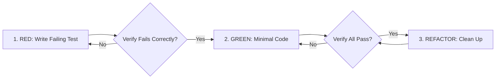

# 09. Contributor Guide

We welcome contributions! This guide will help you get started.

## Development Environment

### Prerequisites
*   Python 3.10+
*   Go 1.24.3+ (for the Go Tester sidecar)
*   Docker (optional, for local containerized runs)

### Setup
1.  **Clone the repository:**
    ```bash
    git clone https://github.com/AmirrezaFarnamTaheri/ConfigStream.git
    cd ConfigStream
    ```

2.  **Create a virtual environment:**
    ```bash
    python -m venv venv
    source venv/bin/activate
    ```

3.  **Install dependencies:**
    ```bash
    pip install -e ".[dev]"
    ```
    This installs the package in editable mode along with development tools (flake8, mypy, pytest, etc.).

4.  **Install Playwright browsers (for E2E tests):**
    ```bash
    playwright install --with-deps
    ```

## Coding Standards & Engineering Workflow

We enforce strict code quality standards across Python, Go, and Frontend code.

*   **Formatting:** We use `black` for Python and `gofmt` for Go.
    ```bash
    black .
    ```
*   **Linting:** We use `flake8`. `golangci-lint` is a proposed future gate and must not be assumed available.
    ```bash
    flake8 src tests
    ```
*   **Type Checking:** We use `mypy` with the repository configuration. Strict mode is a proposed future migration.
    ```bash
    mypy src
    ```

### 1. Source-Driven Development (`/source-driven-development`)

Every framework-specific or protocol-specific implementation decision must be grounded in official, version-matched documentation (e.g. [Pydantic v2 Docs](https://docs.pydantic.dev/), [Go Standard Library](https://pkg.go.dev/), [Sing-box Core](https://sing-box.sagernet.org/)). Never author code from unverified model memory.

```text
DETECT ──→ FETCH ──→ IMPLEMENT ──→ CITE
  │          │           │            │
  ▼          ▼           ▼            ▼
 What       Get the    Follow the   Show your
 stack?     relevant   documented   sources
            docs       patterns
```

- **Stack Detection**: Identify exact versions from `pyproject.toml`, `go.mod`, and `assets/vendor-manifest.json` before authoring logic.
- **Authoritative Hierarchy**: 1. Official Documentation $\rightarrow$ 2. Official Release Changelogs $\rightarrow$ 3. Web Standards (MDN/W3C). Never cite Stack Overflow or unverified AI summaries.
- **Deep-Link Citations**: In code comments and commit descriptions, provide full URL citations with specific anchors:
  ```python
  # Pydantic v2 model serialization using model_dump
  # Source: https://docs.pydantic.dev/latest/concepts/serialization/#modelmodel_dump
  data = proxy.model_dump(mode="json", exclude_none=True)
  ```

### 2. Test-Driven Development (TDD) Lifecycle (`/test-driven-development`)

We enforce the strict **Red-Green-Refactor** iron law:

```text
NO PRODUCTION CODE WITHOUT A FAILING TEST FIRST
```



1. **RED**: Write a minimal test specifying desired behavior (not internal implementation details).
2. **VERIFY RED**: Run `pytest` or `go test` and confirm the test fails with the expected failure assertion. If it passes immediately, fix the test.
3. **GREEN**: Write the minimal code necessary to satisfy the test. Avoid speculative abstractions.
4. **VERIFY GREEN**: Confirm the test passes cleanly along with the existing test suite.
5. **REFACTOR**: Simplify code, remove duplication, and improve variable naming while keeping all tests green.

### 3. Research Before You Code (`/ecc-search-first`)

Before authoring custom utilities or data structures, execute the Search-First workflow:

```text
┌─────────────────────────┬──────────────────────────────────────────┬─────────────────────────────┐
│ Need Assessment         │ Search Channel                           │ Decision Action             │
├─────────────────────────┼──────────────────────────────────────────┼─────────────────────────────┤
│ Standard Utility        │ Repo grep (`src/`, `utils/`)             │ Reuse existing helper       │
│ Common Protocol / Dial  │ Go standard library (`math/rand/v2`, net)│ Adopt stdlib directly       │
│ Parser / Sanitizer      │ Pydantic v2 / DOMPurify vendored         │ Extend/Wrap verified library│
│ Unique Evasion Logic    │ Architectural Specification              │ Build minimal custom logic  │
└─────────────────────────┴──────────────────────────────────────────┴─────────────────────────────┘
```

- **Decision Matrix**:
  - **Adopt**: Exact match, verified license $\rightarrow$ Use directly without wrappers.
  - **Extend**: Partial match $\rightarrow$ Write thin, documented wrapper.
  - **Compose**: Multiple partial matches $\rightarrow$ Combine focused modules.
  - **Build Custom**: Author bespoke logic only when no standard solution exists.

## Testing & Verification

*   **Run all Python tests:**
    ```bash
    pytest
    ```
*   **Run Go tester tests & benchmarks:**
    ```bash
    cd src/go/tester
    go test -v -bench=. -benchmem ./...
    ```
*   **Run the uTLS client tests:**
    ```bash
    cd src/go/utls_client
    go test -v ./...
    ```
*   **Run unit tests only:**
    ```bash
    pytest tests/unit
    ```
*   **Run E2E tests:**
    ```bash
    pytest tests/e2e
    ```

**Coverage:** The current release workflow enforces an 80% source-coverage threshold. Raising it above 90% is a target that requires an approved CI change and baseline evidence. Every bug fix should include a regression test when practical.

## Frontend Contributions

The frontend is a critical security boundary.
*   **Security (XSS)**:
    *   NEVER use `innerHTML` with user-supplied data unless sanitized with `DOMPurify`.
    *   Use `textContent` or `innerText` by default.
    *   Respect the Content Security Policy (CSP).
*   **Accessibility (a11y)**:
    *   Ensure all interactive elements have keyboard support (`tabindex`, `Enter`/`Space` handlers).
    *   Use ARIA roles (`role="menu"`, `aria-label`) where semantic HTML is insufficient.
*   **Testing**:
    *   Write tests for JS modules where possible.
    *   Verify UI changes in multiple browsers.

## 4. 5-Axis Code Review & Quality Gates (`/code-review-and-quality`)

Every Pull Request is audited across five mandatory dimensions:

```text
                  ┌──────────────────────────────────────────────┐
                  │ 1. Correctness (Spec, edge cases, error paths)│
                  │ 2. Readability (Simplicity, naming, clean DOM)│
                  │ 3. Architecture (Boundaries, DI, no leakage) │
                  │ 4. Security (Zero secrets, sanitized logs)   │
                  │ 5. Performance (No N+1, single-socket UDP)   │
                  └──────────────────────────────────────────────┘
```

- **Severity Prefixes**: Review comments must specify severity: `Critical:` (blocks merge), `Required:`, `Optional:` / `Consider:`, or `Nit:` (cosmetic).
- **Dead Code Discipline**: Unused functions or temporary backwards-compatibility shims must be deleted rather than left behind.
- **Change Sizing**: Target $\sim 100 - 300$ lines changed per PR. Split $>1,000$ line diffs into stacked PRs.

## 5. Dependency Triage Protocol (`/dependency-triage`)

Before modifying or upgrading dependencies in Python or Go:

| Risk Level | Definition | Protocol |
|:---|:---|:---|
| **Patch** | Semver patch or lockfile-only security fix | Safe to update with green CI test suite. |
| **Minor** | Semver minor with backwards-compatible features | Requires full integration validation and changelog review. |
| **Major** | Semver major with potential breaking API changes | Requires human architectural review, migration plan, and ADR. |

- **Single Dependency Rule**: Never bundle multiple unrelated package updates into one commit.
- **Lockfile Integrity**: `go.sum` and pinned digests must be updated deterministically via package managers (`go mod tidy`).

## Pull Request Workflow

1.  Create a new branch for your feature or fix.
2.  Write code and tests.
3.  Ensure all checks pass locally (`pytest`, `flake8`, `mypy`, `go test`).
4.  Submit a Pull Request with a clear description of your changes.
5.  Address any review comments.

## Project Structure

| Directory | Purpose |
| :--- | :--- |
| `src/configstream/` | Main Python package — pipeline, parsers, testers, intelligence, generators, models |
| `src/configstream/intelligence/` | Intelligence layer — washer, chaining, evasion, adaptive timeout, circuit breaker |
| `src/configstream/generators/` | Output format generators (Sing-box, Clash, Plaintext, Split) |
| `src/configstream/converters/` | Proxy-to-config converters (Sing-box outbound, Clash dict) |
| `src/configstream/parsers/` | Protocol-specific URI parsers (VLESS, VMess, Trojan, SS, etc.) |
| `src/configstream/tools/` | CLI tools — VwarpTool, CensorshipLab (simulation), DNS scanner |
| `src/configstream/history/` | Proxy history tracking, trend export, analytics |
| `src/go/tester/` | Go sidecar — high-concurrency batch tester (NDJSON stdin/stdout) |
| `src/go/tester/wasm_main.go` | WASM tester for browser-side verification |
| `frontend/` | Web interface — Vanilla JS PWA, no build step |
| `frontend/assets/js/` | Core JS modules (main, analytics, statistics, proxies, dynamic-downloads, lab) |
| `tests/unit/` | Unit test suite (750+ tests) |
| `tests/e2e/` | End-to-end tests (Playwright) |
| `tests/fuzz/` | Fuzz testing for parsers |
| `scripts/` | CI helper scripts — merge_batches, deduplicate_sources, frontend verification |
| `tools/` | Standalone tools — Cloudflare Workers, DNS scanner, lab runner |
| `docs/wiki/` | Documentation wiki (this directory) |
| `sources/` | Batch source files (`batch_1.txt` … `batch_17.txt`) |

### Build the Go Tester

The Go tester is optional for basic development but required for full pipeline runs:
```bash
cd src/go/tester
go mod tidy
go build -o configstream-tester .
mv configstream-tester ../../../
```

**Note:** Some tests require the Go binary to be present in the project root or `PATH`.

## Related Documentation

*   **[Getting Started](getting_started.md)** — Full installation walkthrough (venv, Docker, Go tester, `.env`).
*   **[Architecture Deep Dive](02-architecture.md)** — Understand the pipeline before contributing.
*   **[Protocols & Parsing](03-protocols.md)** — Parser robustness rules, validation logic, credential recovery.
*   **[Security & Privacy](07-security.md)** — Security checklist, log sanitization rules, fail-open policy.
*   **[Troubleshooting](10-troubleshooting.md)** — Common dev environment issues and fixes.
