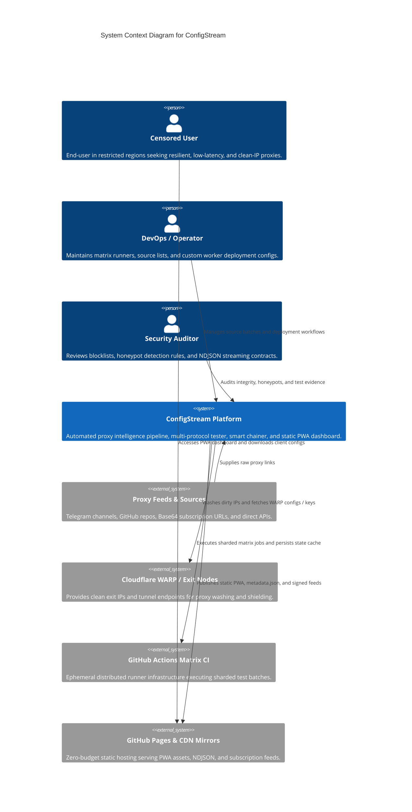
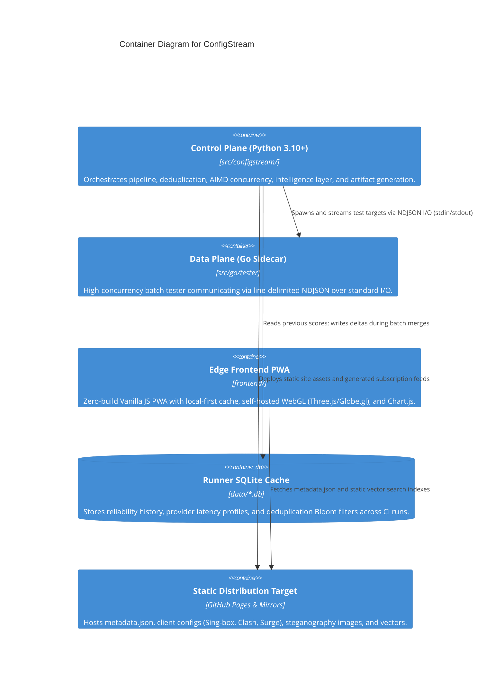

# C4 Architecture & Frontend Design Specification

> **Status: target architecture.** This document describes desired module
> boundaries and user-experience outcomes. It must not be used as a map of the
> current frontend until each target has been implemented and verified. Current
> module locations are authoritative in the source tree and `AGENTS.md`.

This document provides a comprehensive **C4 Model** architectural mapping of ConfigStream alongside the **Frontend Design & UX Standards** (`/architecture-c4-model`, `/architecture-frontend-design`).

---

## 1. Level 1: System Context (C4Context)

The System Context diagram illustrates how ConfigStream interacts with user personas, source repositories, upstream bypass infrastructures, and edge publishing channels.

---

## 2. Level 2: Container Architecture (C4Container)

The Container diagram decomposes ConfigStream into its deployable and executable units.

---

## 3. Level 3: Component Architecture (C4Component)

### 3.1 Control Plane Components (`src/configstream/`)
1. **Source Producer & Fetcher (`producer.py`, `fetcher.py`):** Asynchronously fetches multi-batch raw text feeds, handles rate-limiting, and normalizes URI encodings.
2. **Protocol Parser Engine (`parsers/`):** Robust regex and URL parameter parsers extracting 26+ protocol formats (VLESS, VMess, Trojan, Shadowsocks, Hysteria 2, TUIC) into validated Pydantic models.
3. **Intelligence Engine (`intelligence/`):**
   - *ProxyWasher (`washer/core.py`):* Wraps dirty datacenter exit nodes in Cloudflare WARP tunnels.
   - *Smart Chainer (`chaining.py`):* Builds 9 categories of multi-hop proxy chains using country centroids and Haversine routing.
   - *Anomaly Detector (`anomaly.py`):* Uses Median Absolute Deviation (MAD) heuristics to identify outlier latency spikes.
4. **Output Generators & Adapters (`generators/`, `converters/`):** Serializes validated nodes into Sing-box JSON, Clash/Mihomo YAML, Quantumult X, Loon, Surge, and Plaintext subscriptions.

### 3.2 Frontend Edge Components (`frontend/`)
1. **Core Orchestrator (`main.js`):** Coordinates client routing, offline Service Worker registration, and global state hydration.
2. **Target Data Table Grid (`proxies.js`):** Virtualized, keyboard-navigable proxy catalog with real-time fuzzy filtering and multi-format export.
3. **Target Telemetry & Analytics (`analytics.js`):** Geographic latency heatmaps, protocol distribution, and node trends with layout stability to be measured in browser evidence.
4. **Target 3D Threat & Node Globe:** Extract a globe module from the current analytics surface and add automatic offscreen render throttling.
5. **Target Chain Laboratory:** Continue the modular `assets/js/lab/` package; do not recreate the removed `lab.js` file.

---

## 4. Frontend Design & UX Architecture (`/architecture-frontend-design`)

### 4.0 Target Delivery Sequence

| Phase | Objective | Boundary | Exit evidence |
|---|---|---|---|
| 0 — Trust | Repair and verify public artifact freshness before visual changes | deployment workflow, artifact guard | Live deployment verifier and truthful stale-state UI |
| 1 — Foundations | Adopt tokens, focus behavior, reduced motion, and stable layout reserves | shared CSS and layout helpers | Visual/accessibility suite at 375/768/1024/1440px |
| 2 — Data surfaces | Improve table semantics, filtering, and explicit data states | `proxies.js`, `main.js`, page markup | Fresh/stale/invalid/empty/error fixture tests |
| 3 — Progressive enhancement | Add globe lifecycle and optional virtualization only after the core path is stable | `analytics.js`, optional extracted modules | Mobile performance trace plus browser interaction tests |

An implementation may skip a later enhancement when it harms accessibility,
offline behavior, or the subscription path. No phase is complete from a design
review alone.

### 4.1 Design Feasibility & Impact Index (DFII)
Every visual component and interface flow is audited against the DFII standard (Target: $\ge 8/15$):

| DFII Criterion | Weight | Score | Architectural Implementation |
|:---|:---:|:---:|:---|
| **Aesthetic Impact** | $+3$ | $+3$ | Cold Luxury / Cyberpunk Infrastructure aesthetic with dark glass elevation. |
| **Context Fit** | $+3$ | $+3$ | Utilitarian data density tailored for network engineers and privacy advocates. |
| **Implementation Feasibility** | $+3$ | $+3$ | Zero build-step Vanilla JS architecture with self-hosted vendor libraries. |
| **Performance Safety** | $+3$ | $+3$ | Compositor-only CSS keyframes, 0 CLS, and offscreen WebGL suspension. |
| **Consistency Risk** | $-3$ | $0$ | Strict token enforcement via `DESIGN.md`. |
| **Target DFII score** | — | **$\ge 8 / 15$** | Verify after implementation with documented evidence. |

### 4.2 Intentional Aesthetics & Differentiation Anchor
- **Dominant Tone:** Cold Luxury & High-Trust Cyberpunk Infrastructure.
- **Differentiation Anchor:** If the ConfigStream logo is hidden, the app remains unmistakable through:
  1. Deep Space backdrop (`#0a0e17`) with hairline laser borders (`rgba(255,255,255,0.08)`).
  2. Electric Cobalt (`#3b82f6`) and Neon Cyan (`#06b6d4`) glowing telemetry accents.
  3. Strict `font-variant-numeric: tabular-nums` on all live pings, ports, and bandwidth counters.
  4. Instant zero-network local-first PWA responsiveness.

### 4.3 UI/UX Pro Max Accessibility & Interaction Rules
1. **WCAG 2.2 AA Focus Rings:** All interactive elements feature `:focus-visible { outline: 2px solid #06b6d4; outline-offset: 2px; }`.
2. **Touch Target Standard:** Minimum $44\times44\text{px}$ touch boundary on mobile viewports; $24\times24\text{px}$ on desktop.
3. **Motion Hygiene:** Micro-interactions strictly bounded to $150\text{ms} - 300\text{ms}$; motion automatically collapses under `@media (prefers-reduced-motion: reduce)`.
4. **Iconography:** Cohesive SVG icons with descriptive `aria-label` attributes; zero raw emojis in core UI navigation.

---

## 5. Code Topology & Dependency Graph Architecture (`/graphify-code-topology`)

### 5.1 AST Call Graph & Blast Radius Mapping
Before modifying core modules, database tables, or protocol parsers, ConfigStream maps architectural relationships into topological call graphs:
- **Blast Radius Analysis:** Map inbound/outbound edges from `producer.py` $\rightarrow$ `parsers/` $\rightarrow$ `washer/` $\rightarrow$ `generators/` to prevent silent regression cascades.
- **Cycle Prevention:** Consumer-side interfaces and unidirectional DAG layers prevent circular dependencies between Python intelligence modules and Go sidecars.

### 5.2 Relational Schema & State Graphing (Target)
Specific SQLite storage modules may enable foreign keys and indexed lookups;
this is not a guarantee for every `data/*.db` file. Specific merge functions
may use deterministic upserts, but the strategy must be cited and tested per
database before being treated as a repository-wide invariant.

---

## 6. UI/UX Pro Max System Architecture (`/ui-ux-pro-max`)

### 6.1 Master + Overrides Architectural Pattern
- **Master Tokens (`DESIGN.md`):** Global single source of truth defining colors, typography, spacing, and elevation.
- **Page-Level Scoping:** Individual subpages (`proxies.html`, `analytics.html`, `lab.html`) inherit Master tokens, defining only page-specific layout overrides.

### 6.2 Professional UI Rules & Pre-Delivery Checklist
- **Iconography Standards:** Strict reliance on SVG icons (Lucide / Simple Icons) with fixed `viewBox="0 0 24 24"`. Zero raw emojis used as interactive iconography.
- **Stable Hover Transitions:** Color and opacity transitions only (`transition: color 200ms ease, border-color 200ms ease`); no geometric scaling transforms that cause cumulative layout shifts.
- **Responsive Viewport Spectrum:** Continuous verification across 4 canonical breakpoints:
  - Mobile Small: `375px`
  - Tablet / Foldable: `768px`
  - Desktop Standard: `1024px`
  - Wide Display: `1440px`

---

## 7. Interactive Technical Diagrams & Knowledge Graphs (`/archify`, `/graphify`)

### 7.1 Archify Diagramming Standard (`/archify`)
All architecture and pipeline flow diagrams follow Archify spatial narrative principles:
- **Spatial Narrative Flow:** One primary left-to-right or top-to-bottom path; secondary services (monitoring, WARP tunnels, SQLite caching) branch vertically without crossing primary data pipelines.
- **Self-Contained Interactive Delivery:** SVG/HTML diagrams with native Dark/Light theme toggles, dependency-free pan/zoom, and 1200×630 Share Card export.
- **Route Probe & Semantic Lens:** Highlighting directed paths (e.g. `Raw Feeds` $\rightarrow$ `Go Tester` $\rightarrow$ `Washer` $\rightarrow$ `Pages Artifact`) without polluting the base vector layout.

### 7.2 Graphify Code Knowledge Architecture (`/graphify`)
**Proposed capability:** maintain an automated code and documentation topology graph in a generated, ignored directory:
- **Deterministic AST Parsing:** Zero-token AST extraction for Python and Go files generating typed nodes (`Function`, `Class`, `Module`, `OutboundDialer`) and call edges.
- **Interactive Navigation & Traversal:**
  - `graphify query "<concept>"`: Scoped BFS traversal across pipeline components.
  - `graphify path "<nodeA>" "<nodeB>"`: Shortest path dependency resolution between modules.
  - `graphify explain "<node>"`: Plain-language architectural summary of subsystem responsibilities.
- **Continuous Graph Synchronization:** Automatically updated post-refactoring via `graphify update .` to preserve up-to-date structural intelligence.
