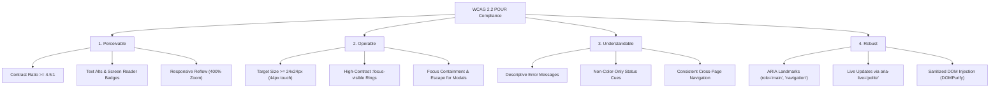
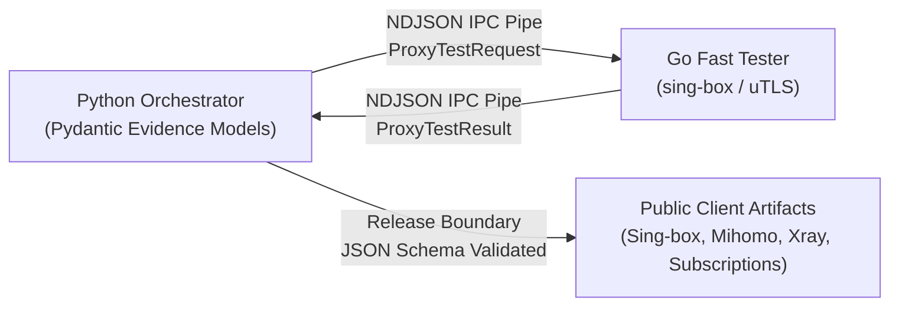

# Interface Design & Accessibility System — ConfigStream

> **Status: target-state specification.** Requirements in this document are
> implementation goals, not completion evidence. Current release status is
> defined by `docs/readiness.json` and browser-backed checks.

## 1. Overview
- **Project:** ConfigStream — Automated Censorship-Resistant Proxy Verification & Subscription Network.
- **Audience:** Privacy researchers, security engineers, dissidents, and everyday users facing hostile national firewalls (GFW, Filternet, DPI censorship).
- **Intent:** Production utilitarian intelligence hub delivering verified, evasion-hardened proxy feeds with zero-friction onboarding, rich real-time telemetry, and 3D geospatial node visualization.

### 1.1 Scope, Non-Goals, and Evidence

This specification governs public static frontend surfaces only. It does not
authorize a new analytics backend, paid telemetry, collection of user browsing
data, or a change to the public artifact format. “Verified”, node counts,
freshness, and performance statements must come from the generated artifact;
they must never be written as fixed marketing copy.

For each UI feature, the implementing change must name: the affected route and
module, its loading/error/empty/success states, keyboard behavior, mobile
behavior, and the test proving it. A design objective remains pending if that
evidence does not exist.

---

## 2. Component Architecture & Design Tokens

Always prioritize native semantic HTML (`<main>`, `<nav>`, `<header>`, `<section>`, `<aside>`, `<table>`, `<button>`) styled with CSS Custom Properties.

### 2.1 Color Palette & Semantic Tokens
```css
:root {
  /* Surface Elevation & Backgrounds */
  --bg-primary: #0a0e17;
  --bg-surface: #111827;
  --bg-glass: rgba(17, 24, 39, 0.75);
  --border-glass: rgba(255, 255, 255, 0.08);
  --border-focus: #06b6d4;

  /* Text & Contrast Hierarchy (WCAG 2.2 AA Compliant) */
  --text-primary: #f9fafb;     /* Contrast > 12:1 against bg-primary */
  --text-secondary: #94a3b8;   /* Contrast > 4.5:1 against bg-primary */
  --text-muted: #64748b;       /* Supplementary text & microcopy */

  /* Brand & Status Accents */
  --brand-primary: #3b82f6;    /* Electric Cobalt */
  --brand-cyan: #06b6d4;       /* Neon Cyan (Focus & Active highlights) */
  --status-success: #10b981;   /* Valid / Shielded (Green) */
  --status-warning: #f59e0b;   /* High Latency / Retrying (Amber) */
  --status-danger: #ef4444;    /* Dead / Dirty Blocked (Coral) */
  --status-revived: #8b5cf6;   /* Warp / Vwarp Revived (Purple) */
}
```

### 2.2 Typography & Numerical Precision
- **Primary Body Font:** System UI font stack (`-apple-system, BlinkMacSystemFont, "Segoe UI", Roboto, "Helvetica Neue", Arial, sans-serif`).
- **Data & Monospace:** System monospace (`ui-monospace, "SFMono-Regular", "Cascadia Code", "Roboto Mono", monospace`).
- **Tabular Figures:** Always apply `font-variant-numeric: tabular-nums` or `font-feature-settings: "tnum" 1` across all data tables, ping latencies, IP addresses, correlation IDs, and counters to eliminate layout jitter.
- **RTL Support:** Bi-directional layout safety with explicit `line-height: 1.6` for Farsi/Arabic script rendering (`README_FA.md` and i18n locales).

---

## 3. WCAG 2.2 Accessibility (POUR Principles)



### 3.1 Target Size & Touch Targets (WCAG SC 2.5.8)
- All interactive controls (`.btn`, `.mode-tab`, `.copy-btn`, pagination triggers) must maintain a minimum bounding box of 24x24px on desktop and 44x44px on touch viewports.

### 3.2 Focus Appearance & Keyboard Navigation (WCAG SC 2.4.11)
- Never suppress `:focus` outlines without providing an accessible alternative:
```css
:focus-visible {
  outline: 2px solid var(--border-focus) !important;
  outline-offset: 2px !important;
  box-shadow: 0 0 0 4px rgba(6, 182, 212, 0.25) !important;
}
```

### 3.3 Non-Color-Only Indicators (WCAG SC 1.4.1)
- Proxy status badges, latency indicators, and validation metrics must combine color with distinct icons or text labels (e.g., green dot + "ONLINE", amber dot + "DEGRADED", red dot + "BLOCKED").

### 3.4 Modal & Drawer Focus Trapping (WCAG SC 2.1.2)
- Architecture node inspector (`#nodeDrawer`) and interactive modals must trap keyboard focus while open, restore focus to the trigger button upon closure, and support dismissal via `Escape`.

---

## 4. High-Conversion Landing Page Architecture (`frontend/index.html`)

```
┌──────────────────────────────────────────────────────────────────────────────────┐
│ 1. ABOVE THE FOLD (Must convert in < 3 seconds)                                 │
│   • Headline: Concrete capability statement; no unverifiable freshness promise │
│   • Subheadline: Automated Sing-box & Clash pipelines with DPI evasion.          │
│   • Primary CTA: [ Copy Universal Subscription ] (1-click clipboard)            │
│   • Proof Signal: Metadata-derived count and timestamp, or an unavailable state │
├──────────────────────────────────────────────────────────────────────────────────┤
│ 2. VALUE PROPOSITION & BENCHMARK CARDS                                          │
│   • Real-Time Telemetry Bento Grid (Clean Proxies, Revived WARP, Threats)       │
│   • 3D Geospatial Ingress-Egress Node Flow Map                                  │
├──────────────────────────────────────────────────────────────────────────────────┤
│ 3. THREE-STEP ONBOARDING WORKFLOW                                               │
│   Step 1: Copy universal or protocol-specific subscription URL                  │
│   Step 2: Paste into Sing-box, Clash Meta, V2rayN, or Shadowrocket              │
│   Step 3: Connect and bypass national deep packet inspection (DPI)              │
├──────────────────────────────────────────────────────────────────────────────────┤
│ 4. OBJECTION HANDLING & TECHNICAL FAQ                                           │
│   • How do we prevent honeypots? (Automated sandbox & TLS JA4 fingerprinting)   │
│   • What if Cloudflare WARP is blocked? (Dynamic Vwarp scanning)                │
│   • Are client subscriptions signed? (Ed25519 cryptographic signatures)         │
└──────────────────────────────────────────────────────────────────────────────────┘
```

---

## 5. Dashboard & Telemetry Patterns

### 5.1 Tables & Structured Data (`frontend/proxies.html`)
- **Headers:** Sticky header (`position: sticky; top: 0; z-index: 10;`).
- **Rows:** Hover highlight with subtle background transition (`rgba(255, 255, 255, 0.03)`).
- **Alignment:** Text left-aligned; latency, ports, and numeric stats right-aligned with `tabular-nums`.
- **Search & Filters:** Inline above table with instant debounced filtering (150ms).

### 5.2 Loading, Empty & Error States
- **Loading:** Non-blocking skeleton loaders with subtle opacity pulse (zero layout shift).
- **Empty State:** Centered illustration/icon + clear message + one actionable reset button (`"Clear Filters"`).
- **Error State:** Descriptive message explaining network failure + manual `"Retry"` button.

### 5.3 State and Data Contract

| State | Required user-facing behavior | Data rule |
|---|---|---|
| Loading | Preserve geometry with a skeleton; do not imply successful verification | No live count or success badge |
| Fresh | Show data and its artifact generation time | Render only after artifact integrity checks succeed |
| Stale | Keep last valid data visible with a clear freshness warning | Use metadata timestamp; never the visitor clock |
| Invalid/untrusted | Block operational actions and explain why | Do not fall back to unsigned or mismatched data |
| Empty | Explain that no usable records are available and offer a safe retry/navigation action | Do not fabricate sample proxies |
| Error | Preserve navigation and offer retry without losing user-entered input | Sanitize any surfaced error detail |

---

## 6. Animation & Motion Guidelines

- **GPU Compositing:** Animate only `transform` and `opacity`. Never animate `width`, `height`, `margin`, or `padding`.
- **Reduced Motion Support:**
```css
@media (prefers-reduced-motion: reduce) {
  *, *::before, *::after {
    animation-duration: 0.01ms !important;
    animation-iteration-count: 1 !important;
    transition-duration: 0.01ms !important;
    scroll-behavior: auto !important;
  }
}
```
- **Offscreen WebGL Throttling:** Three.js / Globe.gl render loops must pause auto-rotation via `IntersectionObserver` when scrolled offscreen.

---

## 7. Universal Avoid List

1. **No Harsh High-Contrast Borders:** Borders should be subtle (`rgba(255, 255, 255, 0.08)`) and never overpower content.
2. **No Layout Shift (CLS):** Always set explicit `min-height` on chart canvases and 3D containers.
3. **No Unsanitized HTML:** All external text, metadata, and markdown must be sanitized with `DOMPurify` before DOM injection.
4. **No Multiple Competing Hero CTAs:** Provide one primary action (`Copy Subscription`) with secondary actions visually demoted.

---

## 8. API & Subsystem Interface Contracts (`/api-and-interface-design`)



### 8.1 Contract-First Subprocess IPC (`ProxyTestRequest` & `ProxyTestResult`)
- **Transport**: Line-delimited NDJSON streaming over standard `stdin`/`stdout`.
- **Correlation ID Integrity**: Every request carries a required `id: string`. The Go tester uses named returns `(result ProxyTestResult)` and `defer recover()` wrappers to guarantee that even if upstream libraries panic, a valid `ProxyTestResult` containing the correlating `id` and structured error message is returned.
- **Request Schema**:
```json
{
  "id": "req-10293",
  "config": "{\"type\":\"vless\",\"server\":\"1.2.3.4\",\"server_port\":443,...}",
  "timeout": 5000,
  "url": "https://cp.cloudflare.com/generate_204"
}
```
- **Response Schema**:
```json
{
  "id": "req-10293",
  "success": true,
  "latency": 142,
  "error": ""
}
```

### 8.2 Public Client Artifact Contracts
As codified in [`docs/client_format_contracts.md`](docs/client_format_contracts.md):
1. **Sing-box JSON**: Emits validated `outbounds` and `endpoints`. Stale selector/URL-test groups fall back safely to `direct`.
2. **Mihomo YAML**: Emits modern `dialer-proxy` chains, eliminating legacy `relay` groups.
3. **Xray JSON**: Flat VMess/VLESS settings with non-empty outbounds and built-in routing rules.
4. **Subscription Pairs**: Strict 1:1 UTF-8 plaintext $\leftrightarrow$ Base64 parity across `proxies.txt`, `proxies-dns-safe.txt`, and `proxies-dns-hardened.txt`.

### 8.3 Error Semantics & Boundary Validation
- **Boundary Validation**: Deep validation and sanitization are enforced at the system edges (untrusted remote URLs, CLI inputs, Pages release boundary). Internal functions operate on typed immutable Pydantic/Go struct instances.
- **Hyrum's Law Adherence**: All published telemetry (`metadata.json`) adheres to strict JSON Schema (`schema/metadata.schema.json`), ensuring downstream GUI clients (NekoBox, Clash Verge, Shadowrocket) never break due to unexpected schema drift.
- **The One-Version Rule**: A single authoritative metadata specification and unified capability matrix (`capability_registry.json`) are maintained across the entire system.
